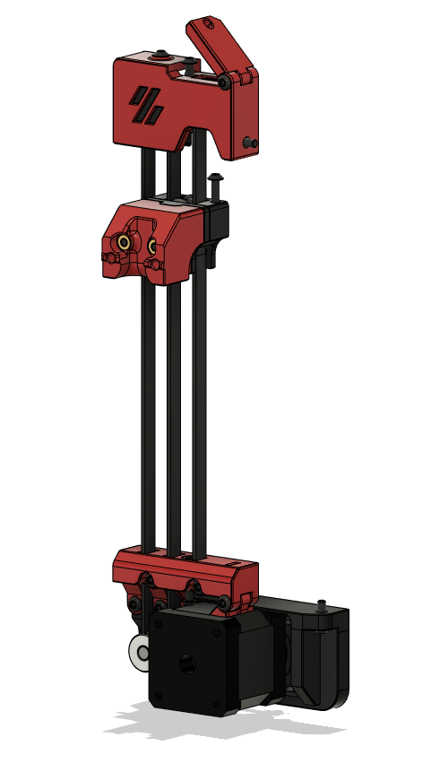

# Overview
A block & tackle Z belt implementation for the Voron 0 / Voron 0.1.

The goal was to make use of the original V0 Z motor and timing belt in a compact format, using hardware and screws already in the V0.1 BoM where possible. No additional M3 nuts need to be preloaded - so no disassembly of the frame - though two will need to be inserted into one of the Z axis extrusions.

By default this mod uses 40T & 16T pulleys, combining with the 2:1 of the block and tackle, to give a 5:1 ratio.

Larger pulleys - up to 64 teeth - can be used to increase this ratio, but will require longer timing belts.

The V0 skirt/feet are too short, so this mod requires a taller skirt, such as [hartk1213's extrusion skirt mod](https://github.com/VoronDesign/VoronUsers/tree/master/printer_mods/hartk1213/Voron0_ExtrusionSkirt), [doubletrouble023's skirt mod](https://github.com/VoronDesign/VoronUsers/tree/master/printer_mods/doubletrouble/V0_Skirt_Mod), or [my own Trident-style skirt mod (WiP)](https://github.com/Fleafa/VoronUsers/tree/V0.1-Trident-skirt/printer_mods/MCMBen/Voron0_Block_and_Tackle_Z_Belt).
The V0.1 skirt/feet have enough height, though a 64T pulley may be a squeeze.

*Testing has shown there is a maximum of 115mm in Z with the original design. The current files have been modified to address this, but the travel distance has not been tested.*

Both the V0 and V0.1 bed positions are now supported - just print the appropriate bed_front_\*.stl file.




# BoM
This BoM doesn't include the 2x self-tapping screws, M3x12 BHCS, and Omron switch for the Z stop, though for clarity it does include some hardware which is reused from the V0 and V0.1 builds.
## Common
Component | Quantity
--- | :-:
M3x8 BHCS | 2
M3x10 BHCS | 5
M3x12 BHCS | 3
M3x16 BHCS | 6
M3x25 BHCS | 3
M3x30 BHCS | 2
M3 threaded insert | 6
3x12 pin | 1
F623 bearing | 6
F695 2RS bearing | 1
MF105 bearing | 1
GT2 16T pulley | 3
NEMA14 motor | 1
3x6x0.5 shim | 6
5x10x0.5 shim (optional) | 2-4
5x50 shaft | 1
GATES GT2 open belt | ~700mm

## Timing Belt
Ratio | Type | Length
--- | :-: | ---
5:1 | GATES GT2 | 110mm
6:1 | GATES GT2 | 122mm
8:1 | GATES GT2 | 152mm
&nbsp; | **OR** | &nbsp;
8:1 | GT2 | 146mm

#Klipper Config
This assumes SKR Mini E3 v2 and stock V0 Z motor.
```
[stepper_z]
step_pin: PB0
dir_pin: !PC5           # Remove ! if moving opposite direction
enable_pin: !PB1
rotation_distance: 32
gear_ratio: 40:16, 2:1
full_steps_per_rotation: 200
microsteps: 16
endstop_pin: PC2
position_endstop: -0.10
position_max: 120       # Check that there is enough travel - you may need to reduce this by a couple of mm
position_min: -1.5
homing_speed: 20        # Default 20, Max 100
second_homing_speed: 3.0
homing_retract_dist: 3.0

[tmc2209 stepper_z]
uart_pin: PC11
tx_pin: PC10
uart_address: 1
interpolate: True
run_current: 0.37       # For V0 spec NEMA17 LDO-35STH42-0504AH
hold_current: 0.35
sense_resistor: 0.110
stealthchop_threshold: 500

[printer]
max_z_velocity: 30      # Default 15, test before increasing
max_z_accel: 350        # Default 45, test before increasing
```
