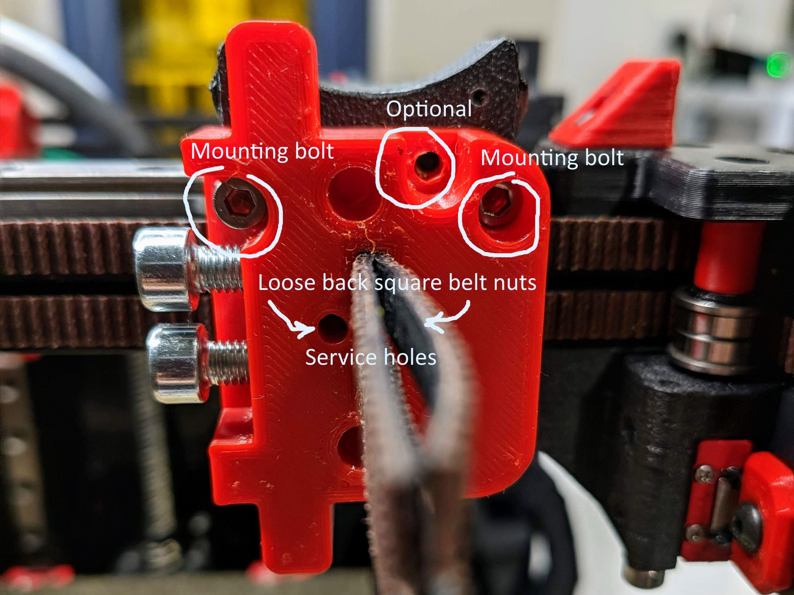

A belt tension helper - is a tool to do pre-tension of belts

A tool act as a helper to do initial belt tension. It is able to do individual belt tension or synced tension of belts

BOM

- 2 or 3 M3 8mm bolts to mount helper to X-carriage

- 2x15mm M5 bolts to fix belts when needed

- 2x40mm M5 bolts and M5 nuts to perform tension

While printing use higher infil for bottom or use cylidric modifies to add stength for pads where M5 bolts will do presure
See example here:

Steps to perform:

Step 1.
Mount bottom part on X carriage and push thought belts. Keep in mind that loose belt backs square nut (use holes for regulate them)

Step 2. Put top part and pass thought belts. Screw tension bolts to have zero minimal gap between bottom and top plate

Step 3. Fix belts on top part but leave loosen on bottom

Step 4. Tension belt by turning the bolts synchronously (do it sequentially by one turn for each)

Step 5. When belt are in tesion fix them using service holes by allen hex key

Step 6. Loose all M5 and unmount top and bottom tool parts

(Optional). When need to do individual belt tension use combination of bolts fix or loosen.
See example for case when need to do extra tension for top belt

