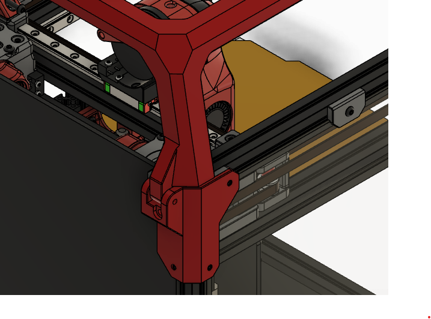
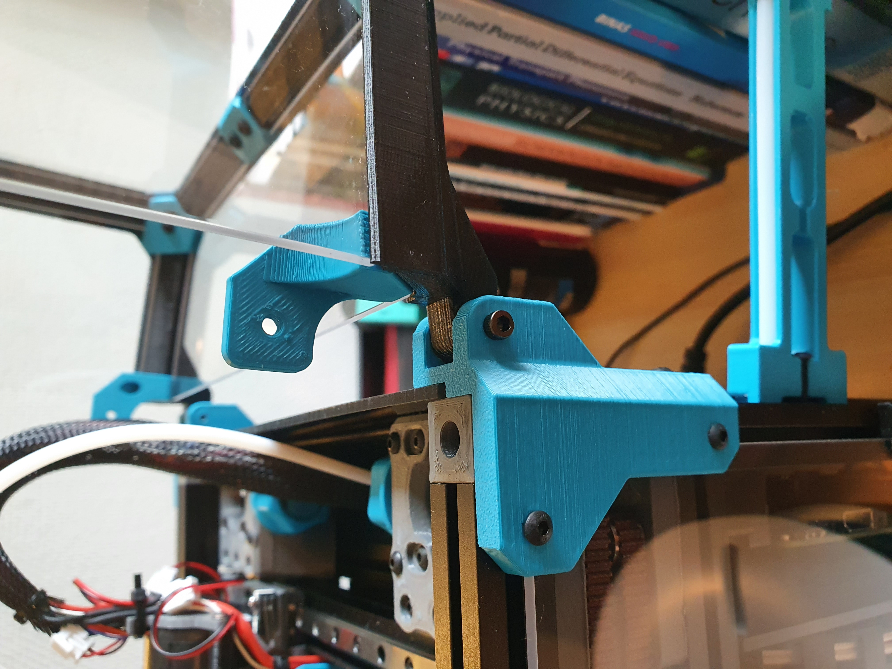
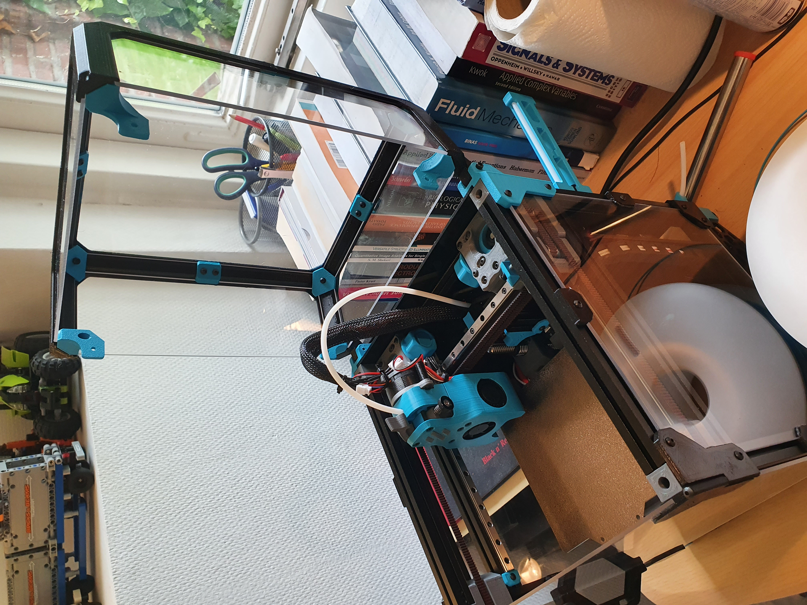
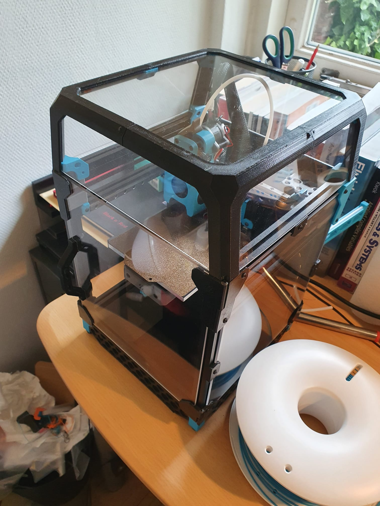
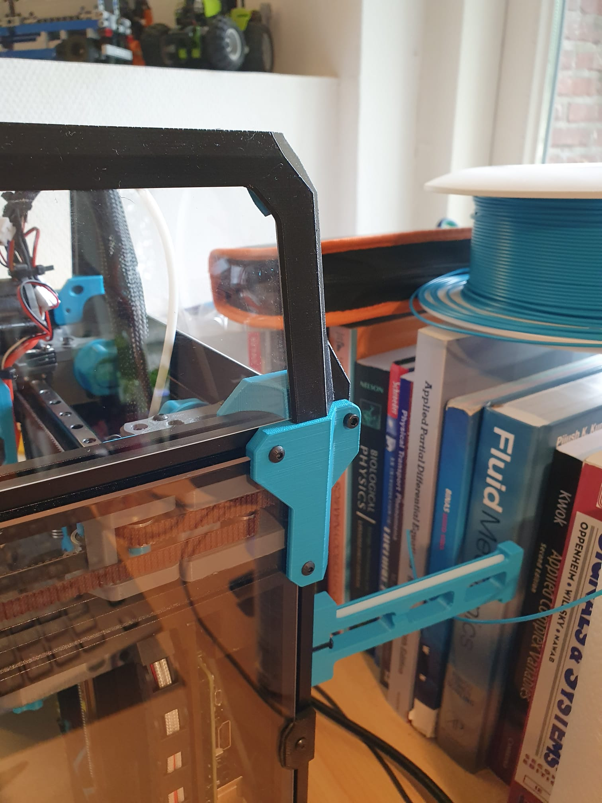

I really like the design of the tophat of the V0 but wanted to be able to open and close it easily.

This is a hinge for the tophat of the V0, without changing the aesthetic.
It uses modified panel mounts and tophat parts. I've added panels mounts for thicknesses of 2, 2.5 and 3mm. 
Also the lower corner clips are adapted to allow for the rotation.
All parts can be printed without support.

Printed and tested: the tophat is relatively stable and stays in the open position.

Requirements:

4 x M3x20

6 x M3x12

