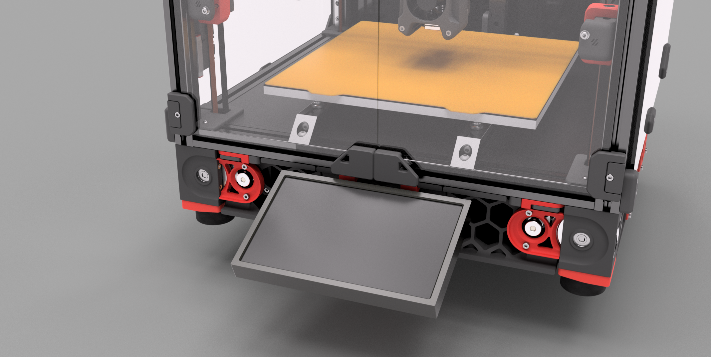
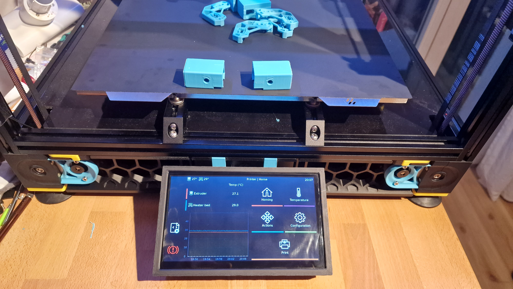
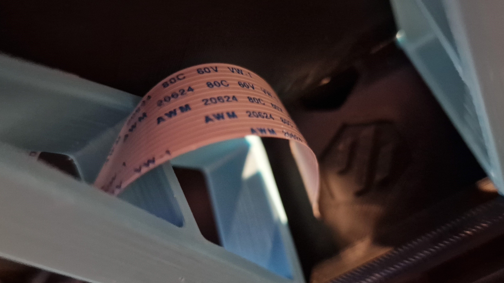

# Overview:

This mod adds a mount for the BigTreeTech PiTFT. Currently the mod works for the PiTFT70, but im planning on adding a 5" and 3,5" option.
The Mount allows the doors to work without any mods and doesnt protude beyond the Skirts. It adds about 11cm to the depth of the printer.

## BOM:

- 1x M3 T-Nut/Hammerhead Nut
- 1x M3x8mm SHCS
- 2x M5 T-Nut/Hammerhead Nut
- 2x M5x10mm BHCS
- 4x M2,5x14mm BHCS _**OR**_ 4x any M2,5 longer than 6mm
- 1x PiTFT70
- 1x Flat Flexible Cable 50cm or longer for Pi Cam/Pi Display

M2,5x14mm screws are included in the Display, the included Flex Cable is too short.

## Printing

All Parts are already in the right orientation. Use the standard Voron Specs for printing.

## Installation

1. Attach the 2 Mounts to the Frame with the M5 screws, feed the Cable through the Slot in the middle Skirt and mount it with the M3 screws.

2. Feed the Cable through the back of the Housing and attach it to the Display (unisolated part faces display). Use the Raspberry Mounts to attach the Display/Housing to the Frame.

3. Simply Push the Front Housing onto the back, it should fit

4. Connect the FFC to the Pis Display port (unisolated part faces towards USB).

5. Install Klipperscreen via KIAUTH or by doing it manually.

6. If the Display is flipped upside down, hit the toggle switch. Adjust the brightness as needed.

Here is a picture of how the FFC should be routed:

