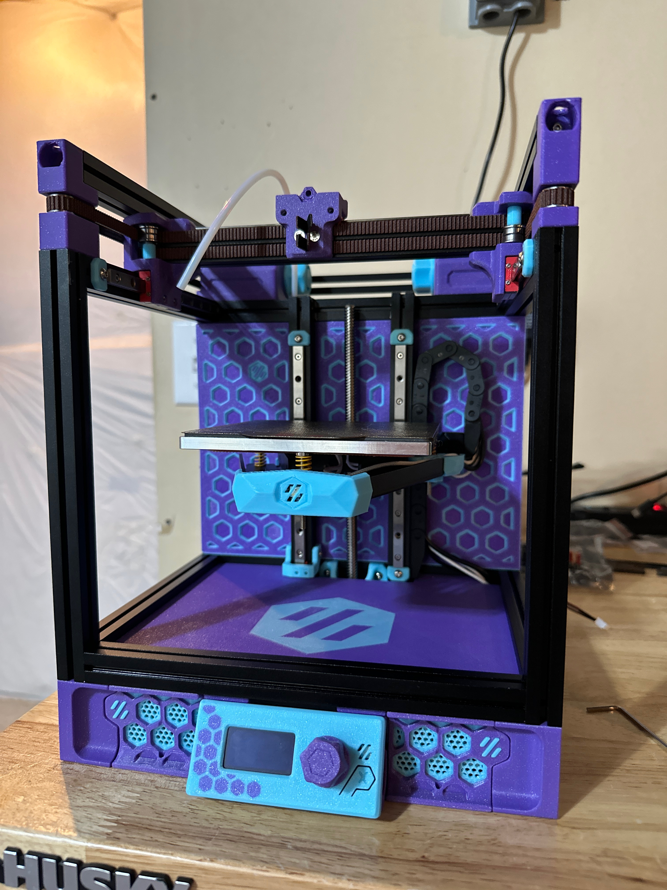
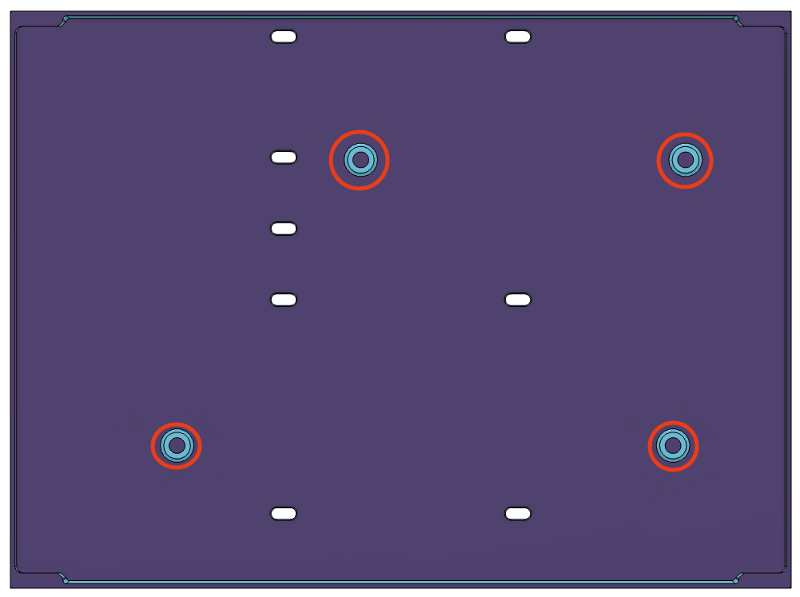
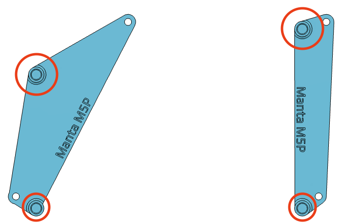
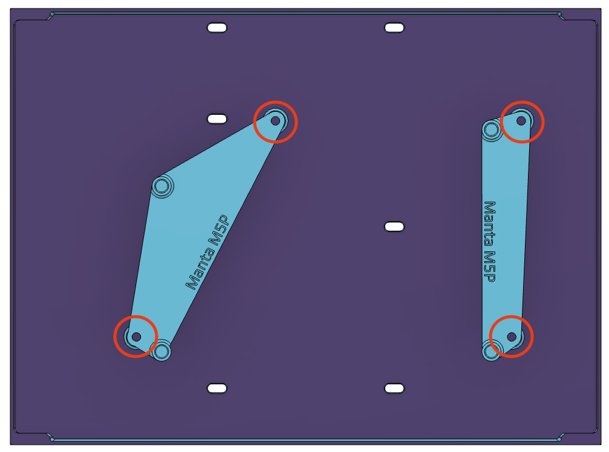
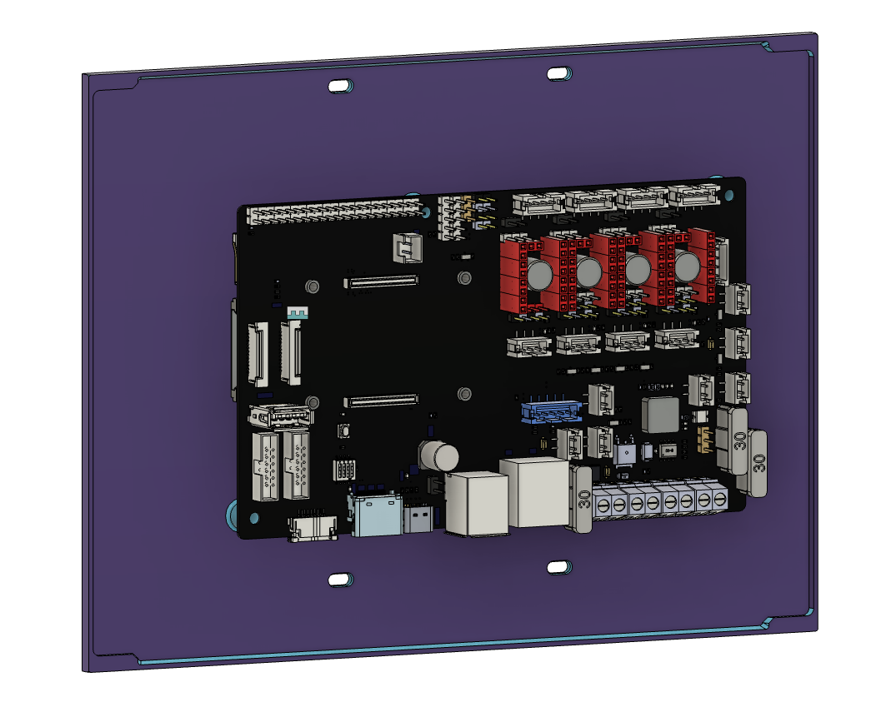
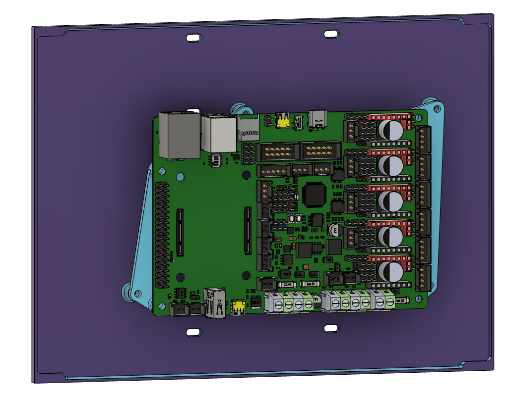

# Hex Mid Panel with Manta Mounts

Replaces the stock mid panel allowing rigid mounting of the Manta M4P/M5P. Based on the [Voron Hex Mid Panel by MandicReally](https://thangs.com/designer/MandicReally/3d-model/Voron%20Hex%20Mid%20Panel%20-%20Accent%20your%200.2%21-960156).

## General Info
- Replaces the stock mid panel
- Can be printed without an MMU/ToolChanger
- Also print the [M5P Spacers](<STLs/M5P Spacers.stl>) if using the M5P in your build
    - No additional parts needed if using the M4P

## BOM
| Item | Qty | Notes |
| --- | --- | --- |
| M3x8 BHCS | 12-16 | 16 required only if using the M5P with the [M5P Spacers](<STLs/M5P Spacers.stl>) |
| M3 Nuts | 8 |
| M3 heat set inserts | 4-8 | 8 required only if using the M5P with the [M5P Spacers](<STLs/M5P Spacers.stl>) |

## Print Settings
- ABS or ASA required
- 4 Perimeters
- 40% infill
- No supports required (Hexes should Bridge fine without supports)

### Multi-Color without MMU Instructions
- Pause at 0.6mm layer height and swap to accent color
- Pause at 2.2mm layer height and swap back to base color

## Assembly Instructions
1. Install 4 heatset inserts into the provided holes on the back of the mid panel 
1. Load 8 M3 nuts into the back of the Z gantry extrusions
1. Slide the mid panel in place of the stock mid panel and attach with 8 M3x8 BHCS 
1. **If using the Manta M5P**, install the additional 4 heatset inserts into the [M5P Spacers](<STLs/M5P Spacers.stl>) now 
1. **If using the Manta M5P**, attach the [M5P Spacers](<STLs/M5P Spacers.stl>) to the mid panel with 4 M3x8 BHCS 
1. Use 4 M3x8 BHCS to attach the MCU to mid panel/spacers

## More Pictures

