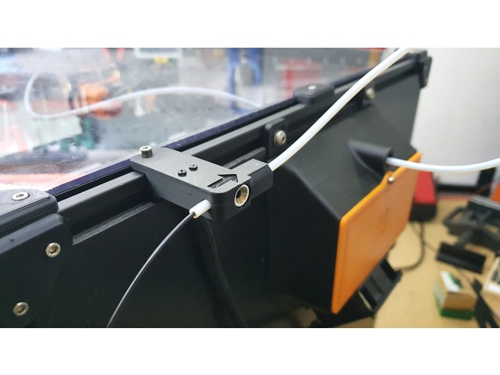
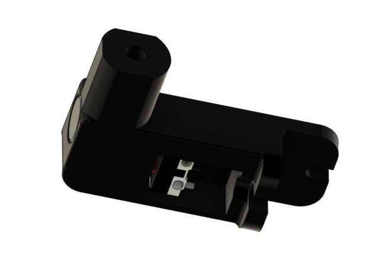
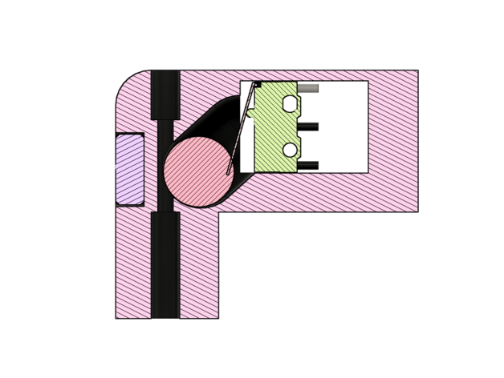

This is a simple Filament Runout Sensor Design I came up with for my Voron printers. It uses a left-over microswitch, a magnet and a 10mm ball bearing ball.

To built this switch you need:
You'll need the following

- standard mciro switch
- 10x4mm round magnet disc
- 10mm ball bearing ball
- 2x 2.3x12mm plastite screw
- 2x M3 Screws
- PTFE Tube

Assembly is pretty self explanatory. After assembly you have to "adjust" the microswitchs position using the slotted holes. The microswitch should be actuated when filamen is inserted and released if it is missing. You can adjust the actuation point by inserting and removing filament manually while listening to the switches klick-sound.

