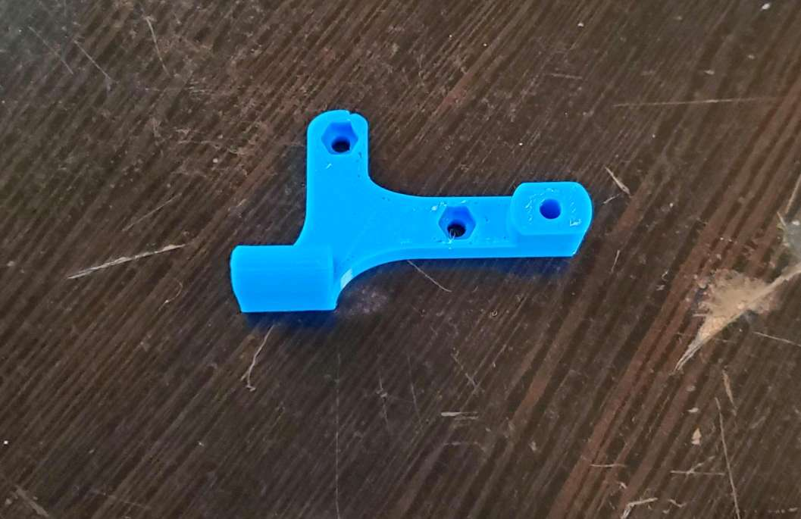
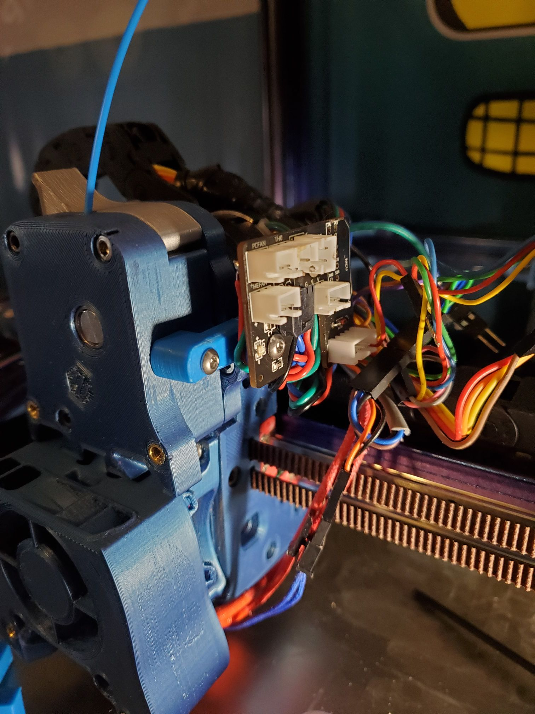

# Simple mount for Hartk board for galileo.

Used to mount the Hartk board using the cover screw mounting locations for the galileo. Uses 1 m3 heat insert and 2 captive M3 nuts. 
Board is available for purchase [here](https://formosissima.com/products/toolhead-board-for-voron-v2-4) 
Github for the board located [here](https://github.com/hartk1213/Voron-Hardware/tree/hartk1213/Voron-Hardware/Afterburner_Toolhead_PCB)

Thanks to Hartk for making an amazing board for our voron needs.

