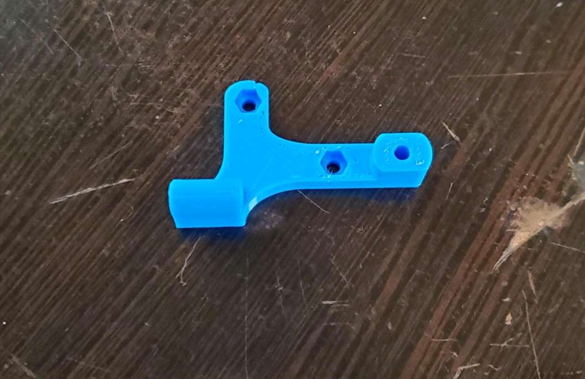
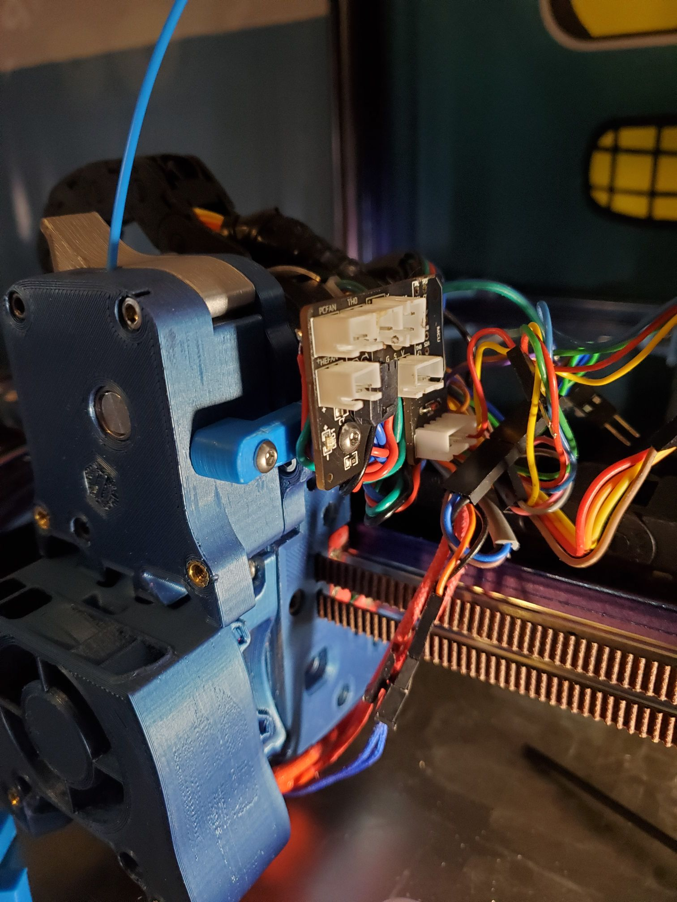

#Simple mount for Hartk board for galileo.

Used to mount the Htark board using the cover screw mouting locations for the galelieo. Uses 1 m3 heat insert and 2 cative M3 nuts. 
Board is avaliable for purchase [here](https://formosissima.com/products/toolhead-board-for-voron-v2-4) 
Git hub for the board  located [here](https://github.com/hartk1213/Voron-Hardware/tree/hartk1213/Voron-Hardware/Afterburner_Toolhead_PCB)

Thanks to Hartk for making and amazing board for out voron needs.
