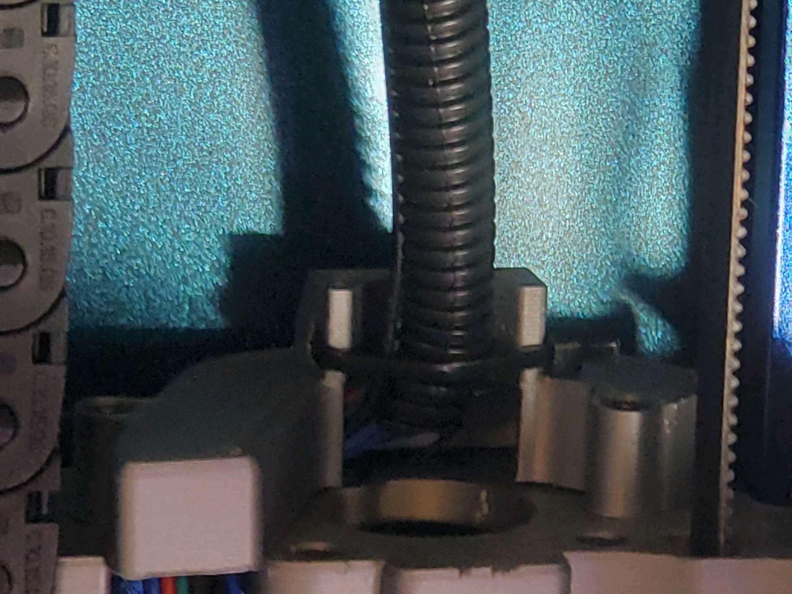
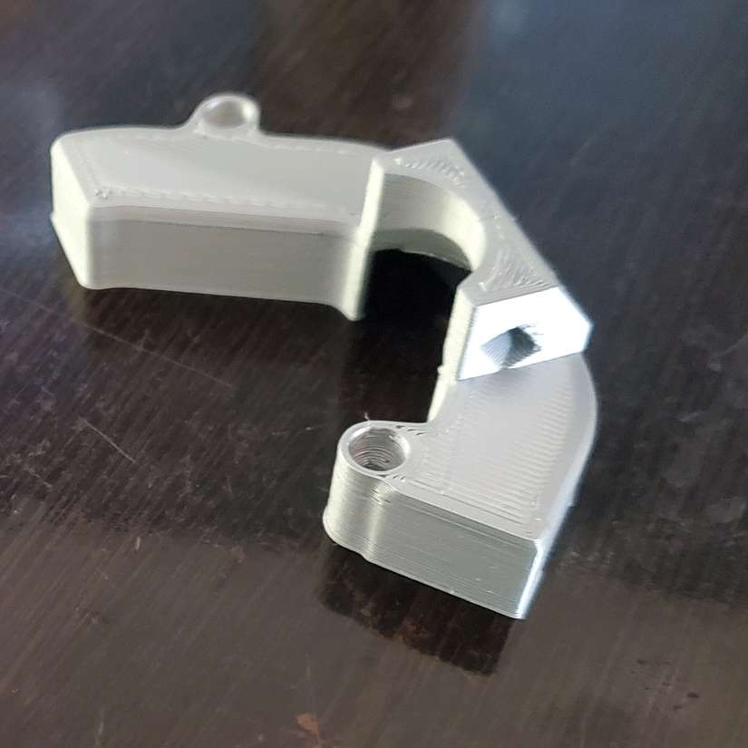

# Umbilical Mount for Voron 2.4 

Mount for 2.4 for performing a cable chain delete. Replaces the cable cover on the A motor with a zip tie mount for securing an umbilical. Uses the same mount and screws as the original cable cover. 

