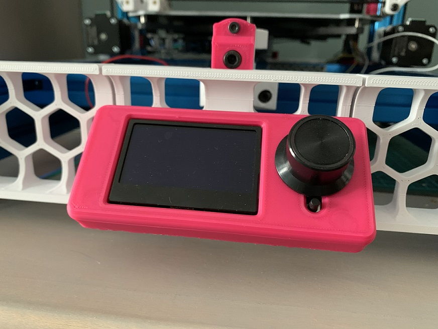

# Why?
I had no intention of enclosing my Switchwire as I have a 2.4.  This machine is going to be dedicated to printing PLA so I just wanted a cleaner front middle grill and here we are!  Obviously this mod is only intended if you don't plan on enclosing your switchwire.

Installation of the center grill does not change.
