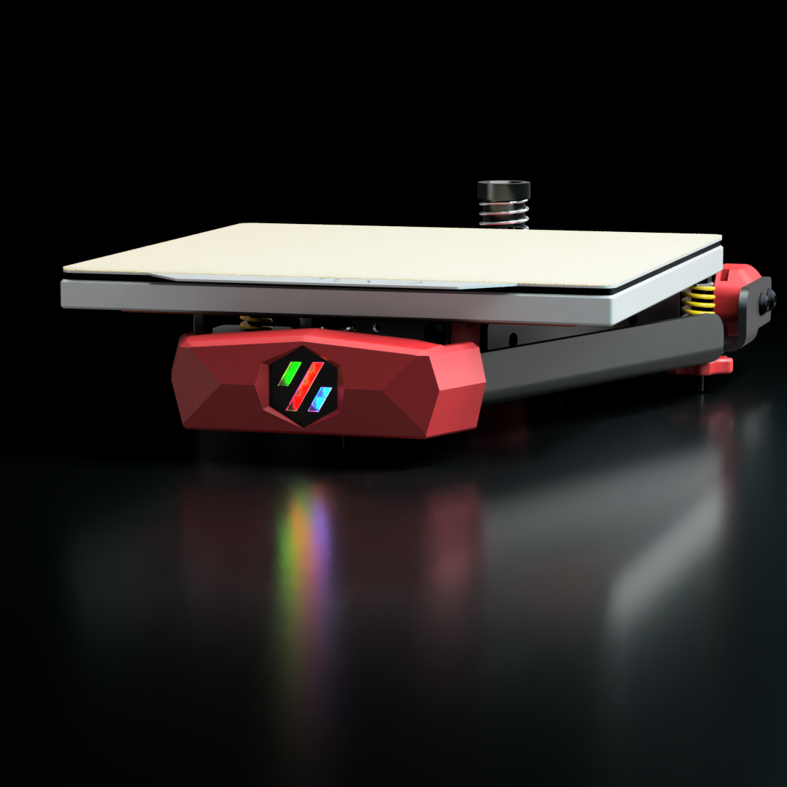

# V0 Stealth Bumper

A low-poly front bumper for your Voron 3D Printer 

Compatible with:
 - [V0 Kirigami Bed](https://github.com/christophmuellerorg/voron_0_kirigami_bed).

Supports the [Rainbow Barf Logo LED](https://github.com/tanaes/whopping_Voron_mods/tree/main/LEDs/Rainbow_Barf_Logo_LED) or a [Neopixel Mini Button](https://www.adafruit.com/product/4776).

# BOM

|Item                           | Qty. |
|-------------------------------|-----:|
| M3x5x4 Heatset Insert         |    2 |
| M3 Hex Nut                    |    2 |
| M3x6 BHCS                     |    4 |
| Neopixel Mini Button          |    1 |
| Rainbow Barf Logo LED         |    1 |

 
**Note:** Only one LED Option is required.  Either the Neopixel Mini Button, *or* the Rainbow Barf Logo LED

# Printing

 - Use standard Voron print settings for all parts.
 - use a clear filament for parts with the `[c]` prefix.
 - print `[a]_main_body.stl`
 - for Rainbow Barf, print `[c]_rainbow_barf_diffuser.stl` and `rainbow_barf_carrier.stl`
 - for Neopixel Mini Button print `[c]_neopixel_button_diffuser.stl` and `neopixel_button_carrier.stl`

# Assembly

- Remove the 2 supports inside the hexagonal hole of `main_body`
- Install 2 heatset inserts into the back of `main_body`
- Press the clear diffuser into `logo_insert`
- Press `logo_insert` into `main_body`
- Press LED (Rainbow Barf, or Neopixel Mini Button) into the appropriate carrier.  Solder wires either before, or after if necessary. (you may not be able to fit a jst connector through the carrier)
- Fit the carrier to the back of `main_body` and fasten with 2 M3x6 BHCS
- Attach `main_body` to the front of the kirigami bed frame, using 2 M3 hex nuts and 2 M3x6 BHCS

# Credits

- Cameron at LDO Motors for the initial work on fitting a StealthBurner diffuser in the design
- WhoppingPochard and VinnyCordeiro for the Rainbow Barf Logo LED

