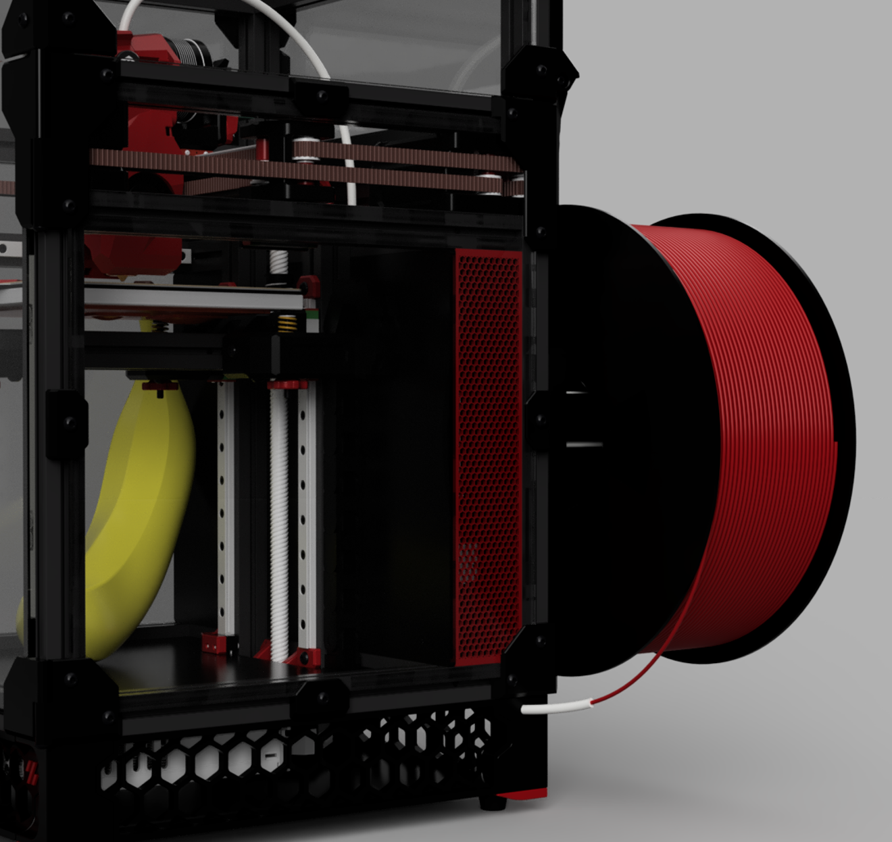
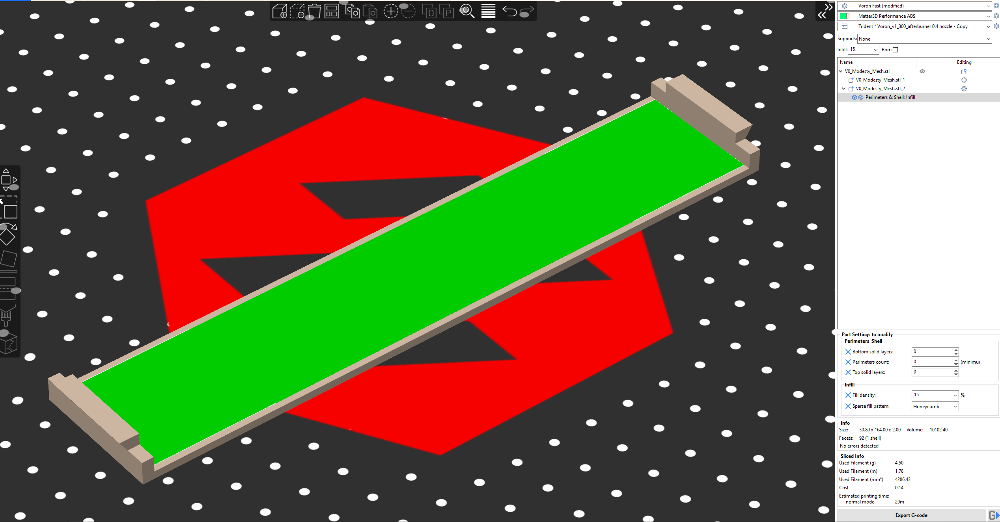
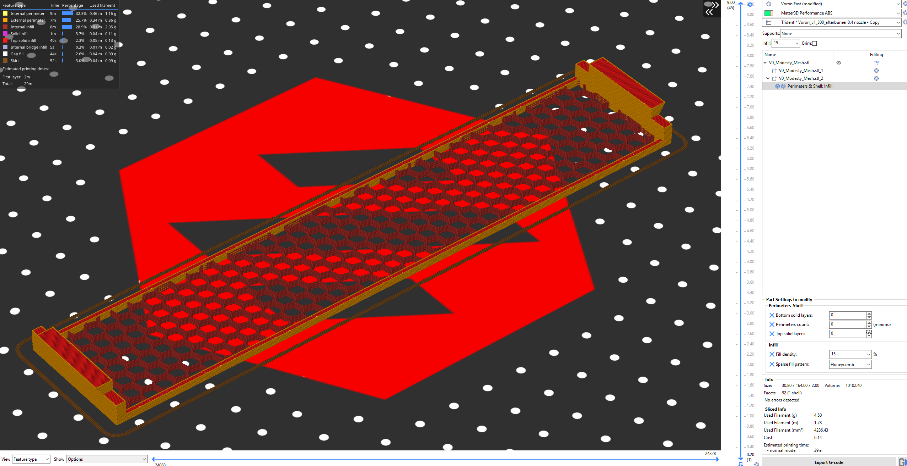

# Modesty Mesh for Voron Zero

Customizable mesh inserts to hide your messy electronics compartment.

## Compatibility

Modesty mesh is compatible with any V0, but it cannot be *printed* on a V0.  You will require a larger printer to print these in one piece.  

## Printing

The STL file includes 2 parts.  Use `split to parts` to separate them in your slicer.  On the inner part, set the top & bottom layers and perimeters to 0, then tweak the infill settings to create a mesh to your taste.

## Installation

Remove your side panel, and insert the modesty mesh into place in the slot of the upper and lower extrusions, just behind the midpanel, then replace the side panel.

