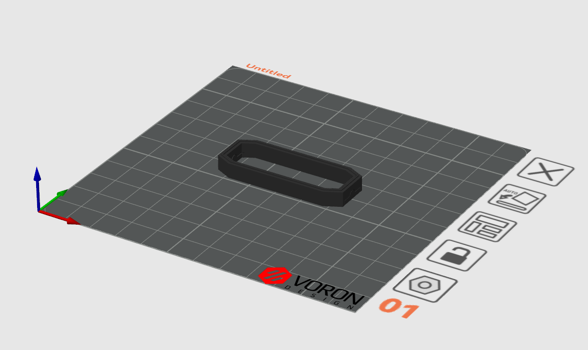
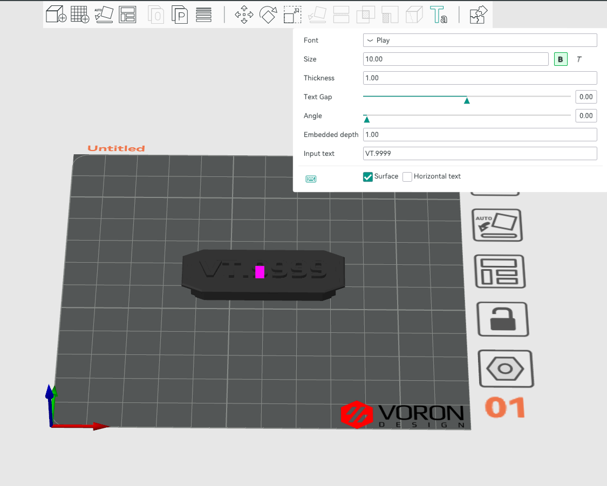

# Rainbow Serial Bumper

Just a little bit of extra bling for your [Voron Trident](https://github.com/VoronDesign/Voron-Trident)

## Bill of Materials

| Component                       | Qty   | Note                                                   |
|---------------------------------|-------|--------------------------------------------------------| 
| M3x8 SHCS                       |  2    | for mounting                                           |
| 2020 M3 T-Nut                   |  2    | for mounting                                           |
| 10mm High Density RGB COB Strip |  50mm | https://www.aliexpress.com/item/1005005486743999.html  |

## Printing

### [a]_main_body.stl

Print in your accent color of choice. Darker colors do a better job of preventing the light from bleeding through, using a high infill percentage can also help.

This part is already oriented correctly for printing and requires no slicer supports.

After printing remove the support piece.

### [o]_insert_collar.stl

Print in black or another dark color.

This part is already oriented correctly for printing and requires no slicer supports.

After printing remove the support pieces.

### [o]_back_plate.stl

Print in black or another dark color.

This part is already oriented correctly for printing and requires no slicer supports.

### [oc]_insert.stl

#### Step 1 - Adding the text

Engrave the text **1mm** into the surface of the part.  Orca Slicer is shown below, but the process should be similar in other slicers.

The recommended font is [Play Bold](https://fonts.google.com/specimen/Play) (aka "The Voron Font") 

#### Step 2 - Preparing to print

This is where the magic happens.  You'll need a black/dark filament, and a clear filament that will stick to eachother.  I used black and clear polymaker PETG.

**Flip the part over 180 degrees.**

**Slicer Settings**

For best results:
 - 1 perimeter
 - 0 top & bottom laters
 - 100% Aligned Rectilinear infill

Slice the part, and insert a pause *after* 1mm, this is where you will switch from dark to clear filament.

## Assembly

**Press the Insert into the Main Body, and then press the collar in the gap.**

**Solder the LED wiring, and insert the LED strip, followed by the back plate.**

## Installation

Install on the front bed extrusion of your Voron Trident, or anywhere else you think it would look cool.

