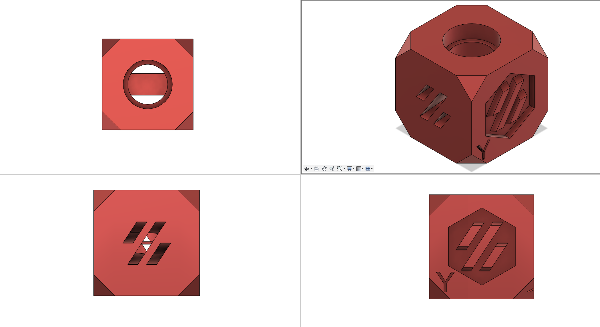
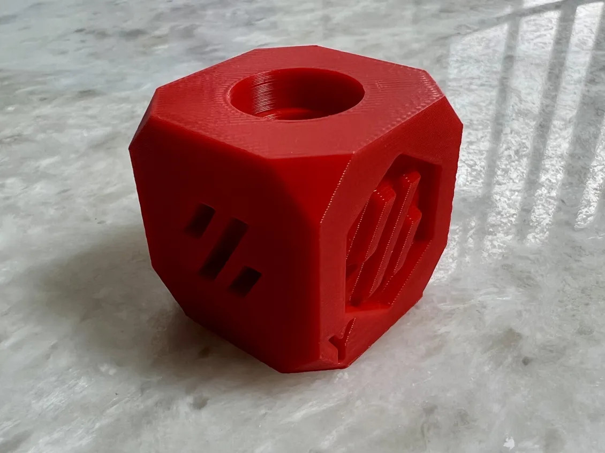

# Voron Design Cube

A calibration cube for Voron printers

It can be used to verify your print quality is sufficient to print Voron parts.  

## Printing

Use standard voron print settings. 4 walls, 5 top & bottom laters, 40% infill.

