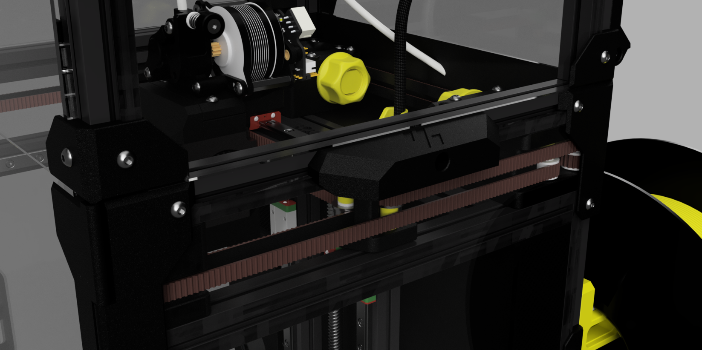

# V0 Stealth Handles

Stealthy and stylish handles for your Voron V0

These handles replace the top center panel clips, and fasten with M3x12 screws.

## Printing

The STL files are already oriented for printing.  No supports are required.  Yes, they print at a 45 degree angle, for some extra strength.

## Changelog

2023-08-24 - Slim down the tabs by 0.2mm for a better fit with some extrusions.

