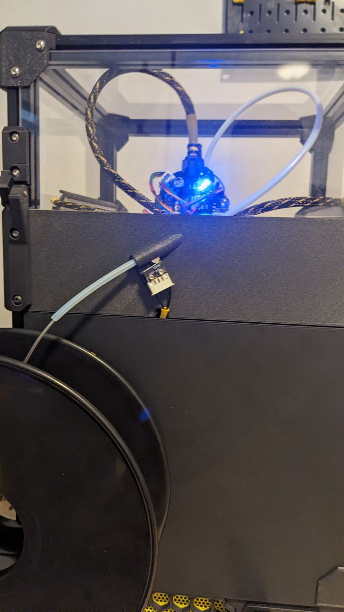

# V0 Upper-Rear Bowden Inlet (URBI)

A Reverse Bowden Inlet for the upper-rear panel of the Voron Zero with an optional filament sensor.

There are 6 Variants:
- URBI - The basic, just a hole to pass the bowden tube through.
- URBI-PC4 - with a thread to install a PC4-M6 fitting
- URBI-ECAS4 - with an inverted ECAS4 fitting
- URBIFS - with a filament sensor
- URBIFS-PC4 - with a filament sensor, and a thread to install a PC4-M6 fitting
- URBI-SFS2 - For the [BTT SFS V2.0](https://github.com/bigtreetech/smart-filament-detection-module/)

Filament sensor variants require a microswitch and 6x3mm magnet.





## Compatibility

URBI is compatible with any V0 with a split back panel (0.2 or later, or any LDO kit)

However, URBI can *not* be printed on a V0, it's too large. You can cut it into 2 pieces in the slicer and glue them together if you have no other option.

## Assembly

### URBI


### URBI-PC4


### URBIFS


### URBIFS-PC4


### URBI-ECAS4


### URBI-SFS2


## Configuring Filament Sensors

All filament sensor configurations assume you have a `[respond]` section defined in your configuration to enable the RESPOND gcode command.


### _FS_RUNOUT Macro

This macro will be called when the filament sensor detects a runout/jam.  feel free to customize this.

```yaml
[gcode_macro _FS_RUNOUT]
gcode:
  M300 S660 P300  ; BEE
  M300 S440 P300  ; BOOP
  RESPOND TYPE=error MSG="Filament Runout"  ; Display a message in the console
  M117 "Filament Runout"  ; Display a message on the LCD
  PAUSE   ; Call the pause macro

```

### _FS_ENABLE and _FS_DISABLE macros

These macros are used to enable the filament sensors during printing and disable them otherwise.  These are optional, but whether or not you use them, you should still disable the sensors when they aren't required.
sensors should be enabled in PRINT_START and RESUME, and disabled in PRINT_END, CANCEL_PRINT and PAUSE

```yaml
[gcode_macro _FS_ENABLE]
gcode:
  SET_FILAMENT_SENSOR SENSOR=filament_switch ENABLE=1
  ; SET_FILAMENT_SENSOR SENSOR=filament_motion ENABLE=1  ; Uncomment this line if you are using the SFS V2

[gcode_macro _FS_DISABLE]
gcode:
  SET_FILAMENT_SENSOR SENSOR=filament_switch ENABLE=0
  ; SET_FILAMENT_SENSOR SENSOR=filament_motion ENABLE=0  ; Uncomment this line if you are using the SFS V2
  

# THESE ARE JUST EXAMPLES
# You should modify your own macros to include the calls to _FS_ENABLE and _FS_DISABLE

[gcode_macro PRINT_START]
gcode:
    G28                            ; home all axes
    G90                            ; absolute positioning    
    G1 Z20 F3000                   ; move nozzle away from bed
    _FS_ENABLE                     ; enable the filament runout sensor(s)


[gcode_macro PRINT_END]
gcode:
    M400                           ; wait for buffer to clear
    G92 E0                         ; zero the extruder
    _FS_DISABLE                    ; disable the filament runout sensor(s)    
    ; ... etc ...    
  

[gcode_macro CANCEL_PRINT]
rename_existing: CANCEL_PRINT_BASE
gcode:
  _FS_DISABLE
  CANCEL_PRINT_BASE


[gcode_macro PAUSE]
rename_existing: PAUSE_BASE
gcode:
  _FS_DISABLE
  PAUSE_BASE
  

[gcode_macro RESUME]
rename_existing: RESUME_BASE
gcode:
  _FS_ENABLE
  RESUME_BASE  
```


### URBIFS Basic Runout Sensor

```yaml
[filament_switch_sensor filament_switch]
switch_pin: ^PC15    # Use the correct pin for your mainboard.
pause_on_runout: False
runout_gcode: _FS_RUNOUT
```


### BigTreeTech SFS V2.0

NOTE: The SFS V2.0 includes both a motion and switch sensor, include the above `filament_switch` definition in addition to the one below.

```yaml
[filament_motion_sensor filament_motion]
switch_pin: ^PC12    # Use the correct pin for your mainboard.
extruder: extruder
pause_on_runout: False
detection_length: 2.88
runout_gcode: _FS_RUNOUT

```
