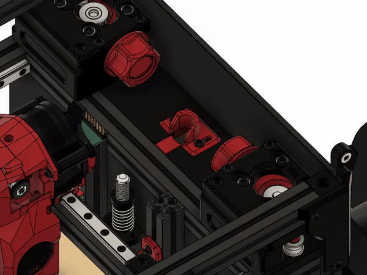
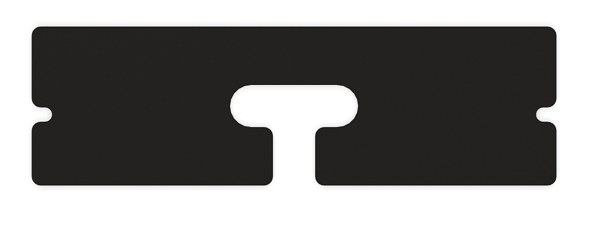
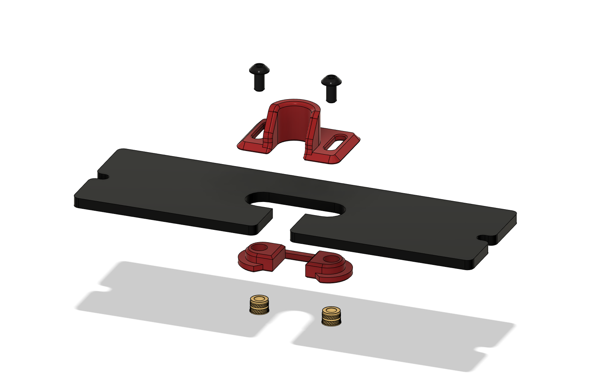

# V0 Umbilical Collar

An adjustable collar for your Voron V0.  

- fills the gap between your chamber and electronics compartment to keep the warm air inside.
- keeps your umbilical away from the belts.

## Compatibility 

This mod is not compatible with the Umbilical PCB from timmit99 or Picobilical PCB from LDO.  
It's designed to work only with the stock motor-panel pictured below

## BOM

- 2x M3x6 or M3x8 BHCS
- 2x M3 Heatset Insert

## Assembly

