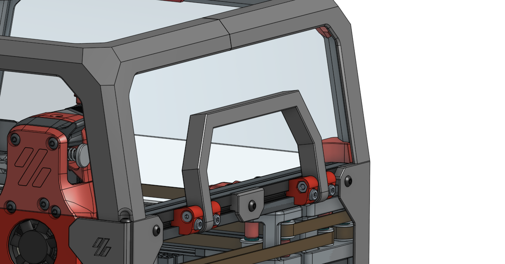
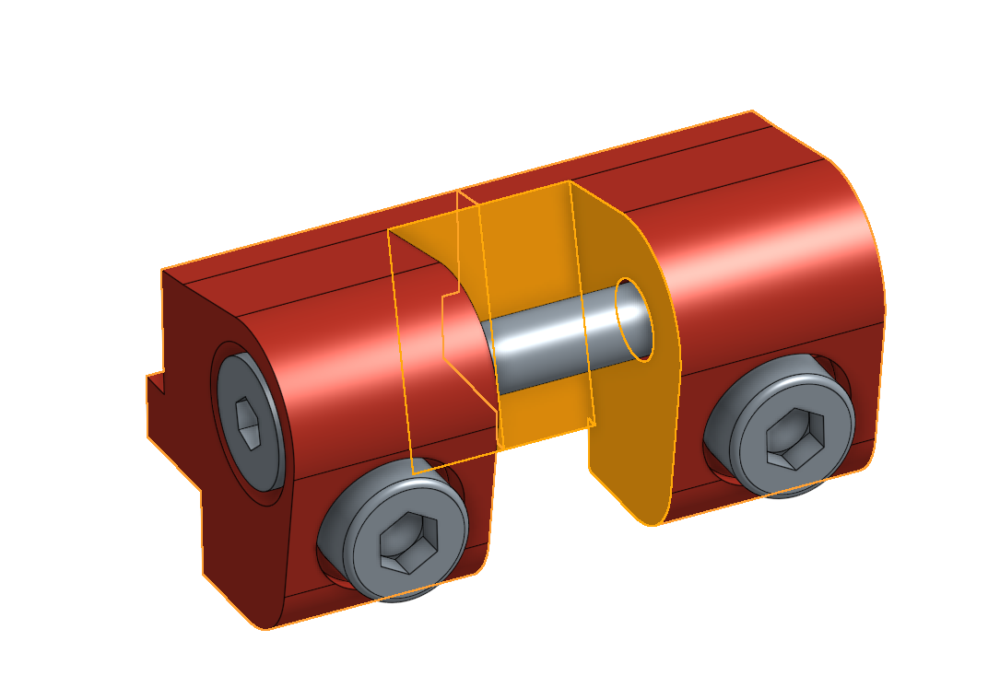
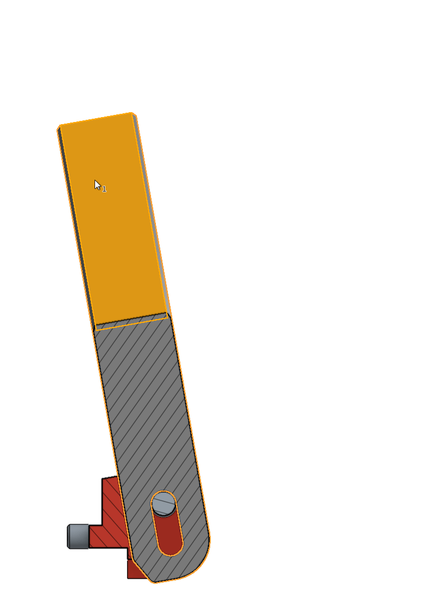
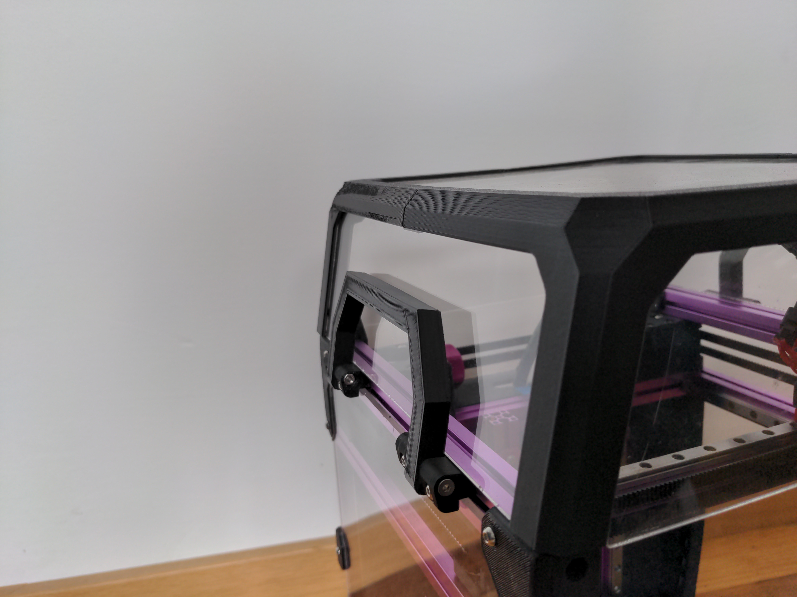
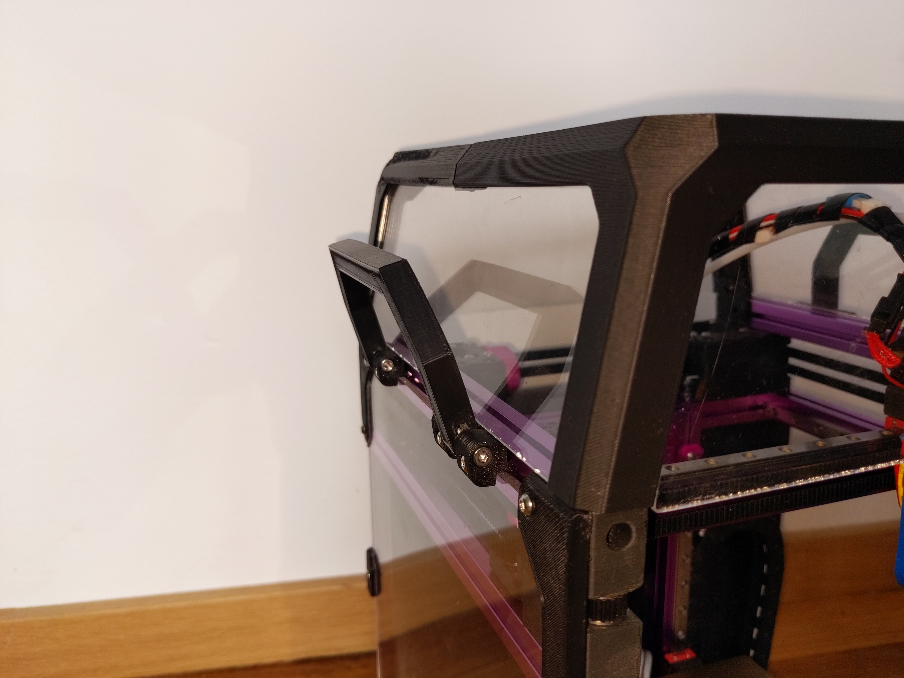

# V0.1 stowable handles

There are already many mods to add handles to the V0,
but I wanted to be able to stow them out of the way against the top hat.

## BOM
- 8 M3x14 SHCS
- 4 M3x25 FHCS
- 12 M3 nuts
- 2 `Handle.stl`
- 4 `Bracket_Outside.stl` (mirror 2 of them)
- 4 `Bracket_Inside.stl` (mirror 2 of them)

## Assembly

1. Install 4 nuts on the outside of the top extrusions.
1. Press an M3 nut into `Bracket_Inside.stl`.
1. Use a small file to make these faces smooth.
    
1. Mount `Bracket_Inside.stl` and `Bracket_Outside.stl` to the pre-loaded nuts with the M3x14 SHCS.
1. Mount the handles in the brackets using the M3x25 FHCS.

## The mechanism

The handles are locked in the "stowed" position by pressing down on them.
They are unlocked by pulling up.

