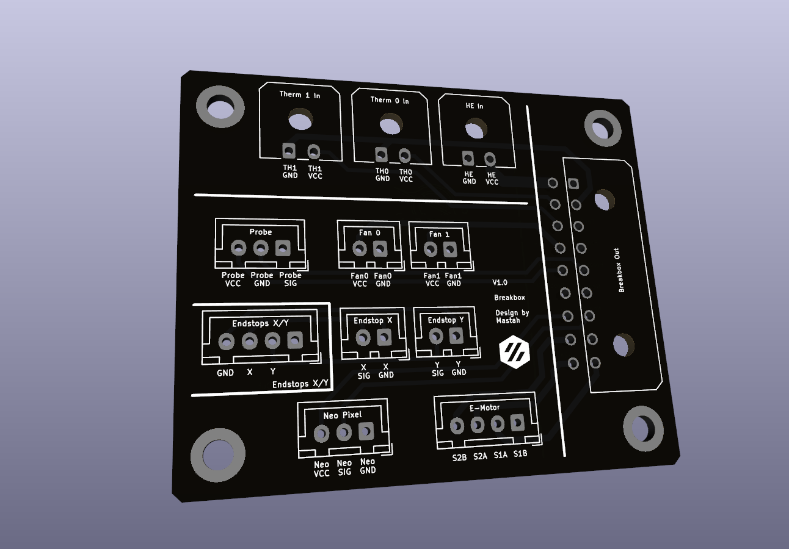
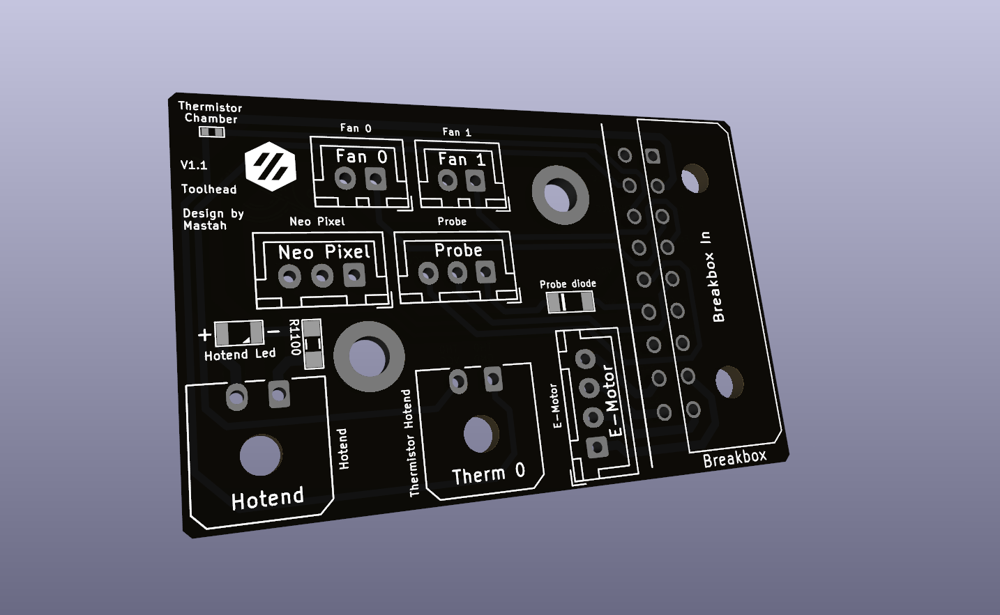
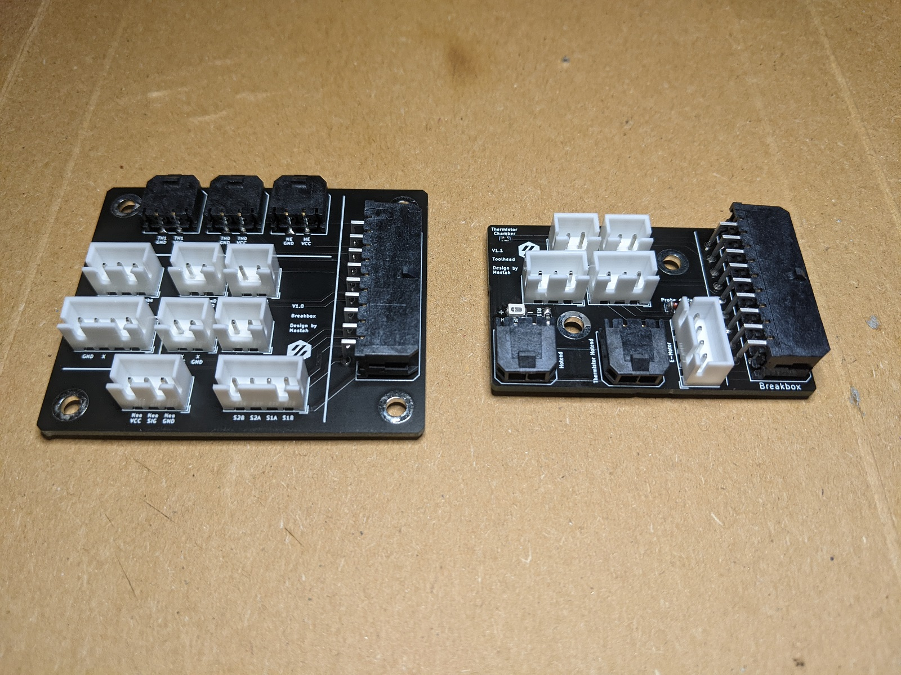
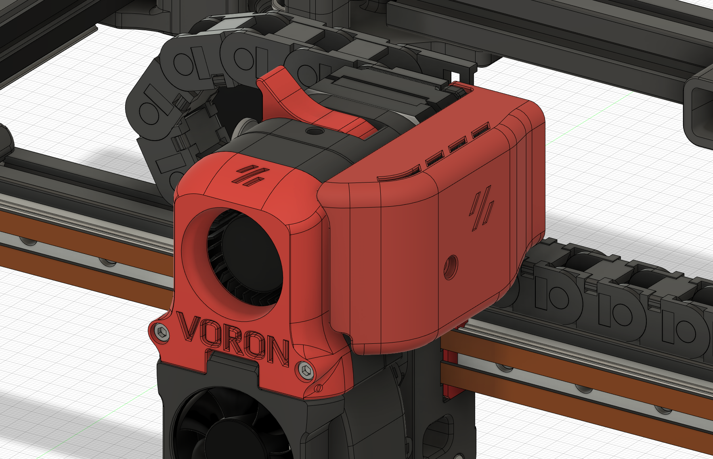
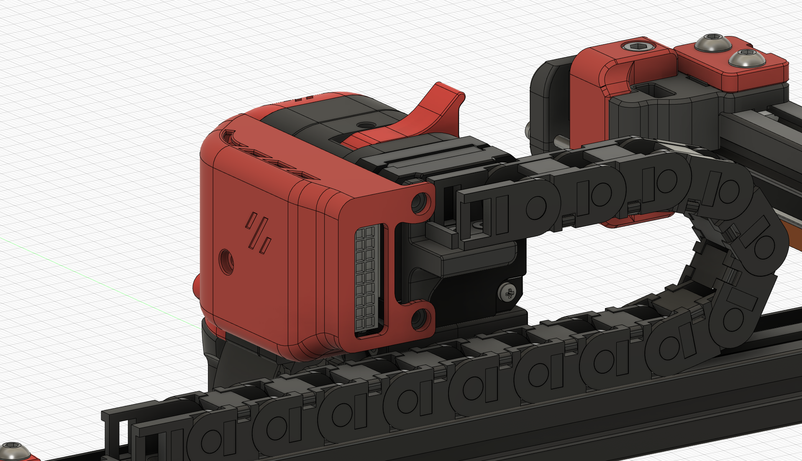
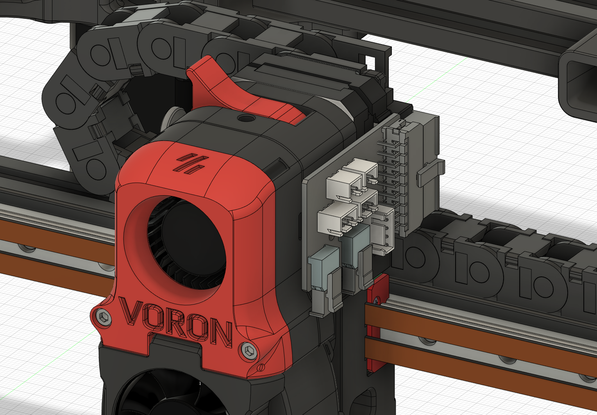
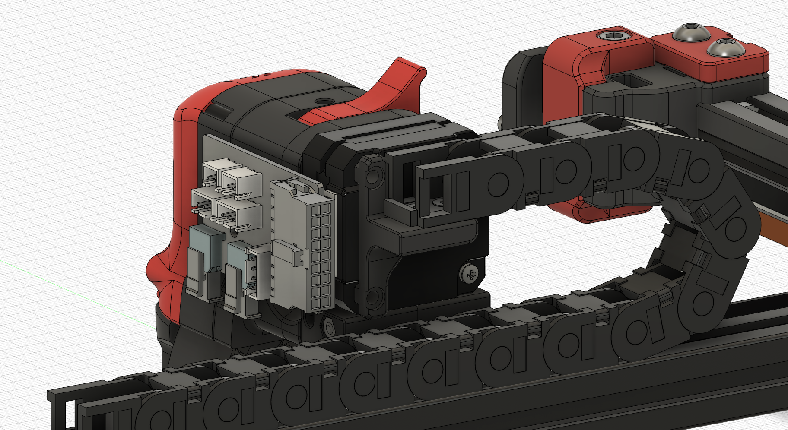

# PCB

## Breakbox

This PCB is used as a breakbox to distribuate and concentrate all necessary wires into a single connector for the toolhead.*

KiCAD files: [kicad](./KiCad/breakbox/)

CAD files: [cad](./CAD/breakbox/)

STLs files: [stl](./STL/breakbox/)

## Afterburner Toolhead

This PCB is used against an afterburner to concentrate all wire in a single connector.

KiCAD files: [kicad](./KiCad/toolhead/vanilla_afterburner/)

CAD files: [cad](./CAD/toolhead/vanilla_afterburner/)

STLs files: [stl](./STL/toolhead/vanilla_afterburner/)

## Images

Final results

