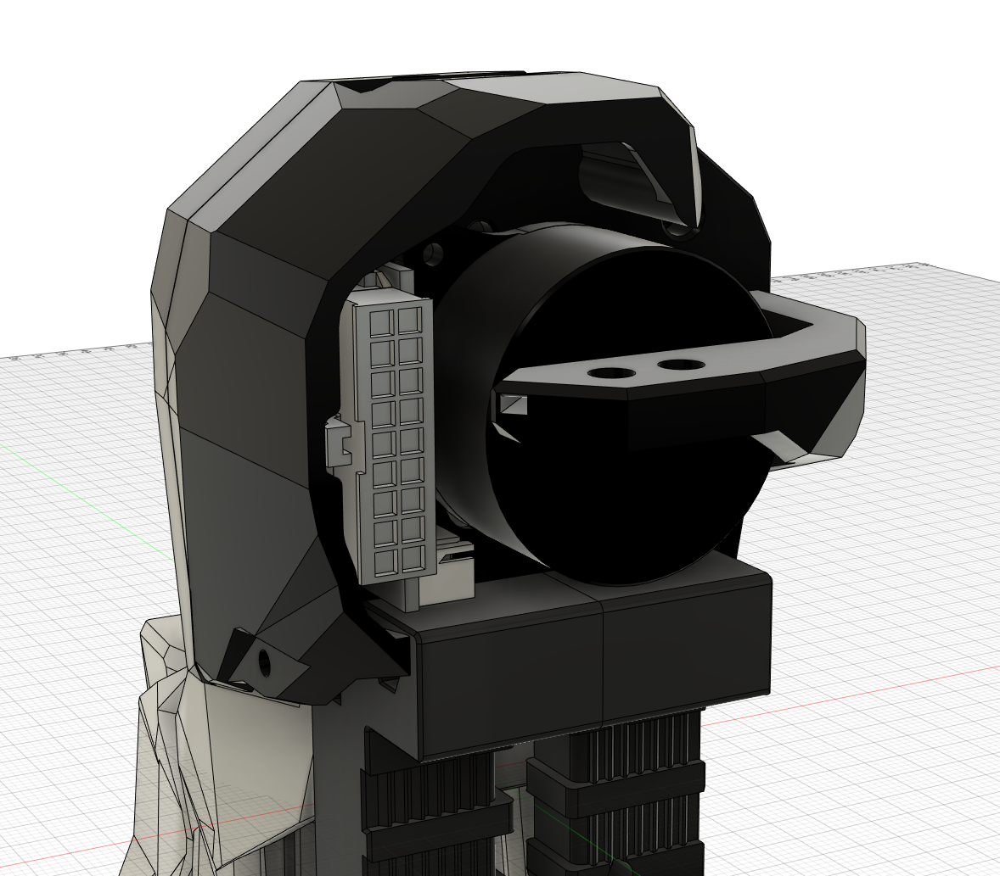

# PCB

## Breakbox

This PCB is used as a breakbox to distribuate and concentrate all necessary wires into a single connector for the toolhead.*

KiCAD files: [kicad](./KiCad/breakbox/)

CAD files: [cad](./CAD/breakbox/)

STLs files: [stl](./STL/breakbox/)

BOM:
- JST-XH 4pin x 2
- JST-XH 3pin x 2
- JST-XH 2pin x 4
- Molex Microfit 436500200 (or equivalent) x 3
- Molex Microfit 430451800 (or equivalent) x 1
- DIN clip x 1 [din clip](https://github.com/VoronDesign/Voron-2/blob/Voron2.4/STLs/Electronics_Bay/pcb_din_clip_x3.stl)
- heat insert x 4
- m3 x 8 SHCS

## Afterburner Toolhead

This PCB is used against an afterburner to concentrate all wire in a single connector.

KiCAD files: [kicad](./KiCad/toolhead/vanilla_afterburner/)

CAD files: [cad](./CAD/toolhead/vanilla_afterburner/)

STLs files: [stl](./STL/toolhead/vanilla_afterburner/)

BOM:
- Resistor (ref CR0805-FX-1101ELF or equivalent) x 1
- Red LED (ref 150302RS73100 or equivalent) x 1
- Thermistor (ref NTCS0402E3104FHT or equivalent) x 1
- Diode (ref BAS85,135 or equivalent) x 1
- JST-XH 4pin x 1
- JST-XH 3pin x 2
- JST-XH 2pin x 2
- Molex Microfit 436500200 (or equivalent) x 2
- Molex Microfit 430451800 (or equivalent) x 1
- m3 x 8 SHCS x 1
- m3 x 25 SHCS x 1

## StealthBurner Toolhead

This PCB is used against a stealthburner to concentrate all wire in a single connector.

KiCAD files: [kicad](./KiCad/toolhead/stealthburner/one_pcb/)

CAD files: [cad](./CAD/toolhead/stealthburner/)

STLs files: [stl](./STL/toolhead/stealthburner/)

BOM:
- Resistor (ref CR0805-FX-1101ELF or equivalent) x 1
- Red LED (ref 150302RS73100 or equivalent) x 1
- Thermistor (ref NTCS0402E3104FHT or equivalent) x 1
- Diode (ref BAS85,135 or equivalent) x 1
- JST-XH 4pin x 1
- JST-XH 3pin x 2
- JST-XH 2pin x 2
- Molex Microfit 436500200 (or equivalent) x 2
- Molex Microfit 430451800 (or equivalent) x 1
- m3 x 8 SHCS x 1
- m3 x 25 SHCS x 1

## Images

Final results

