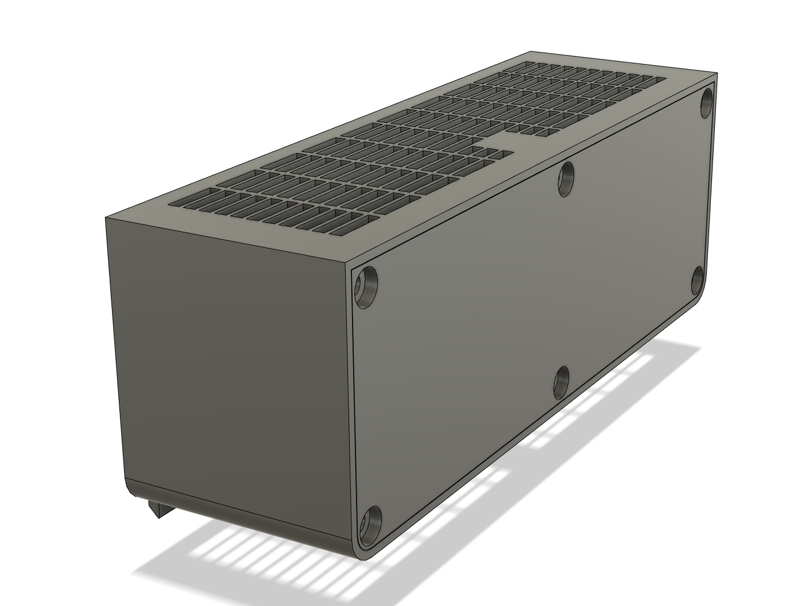
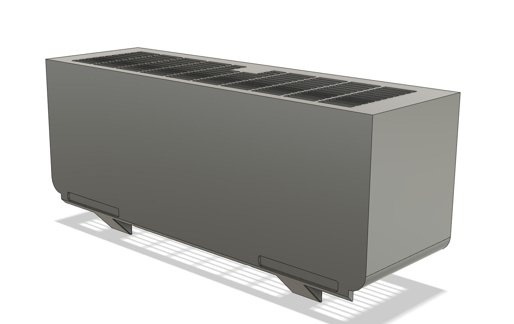
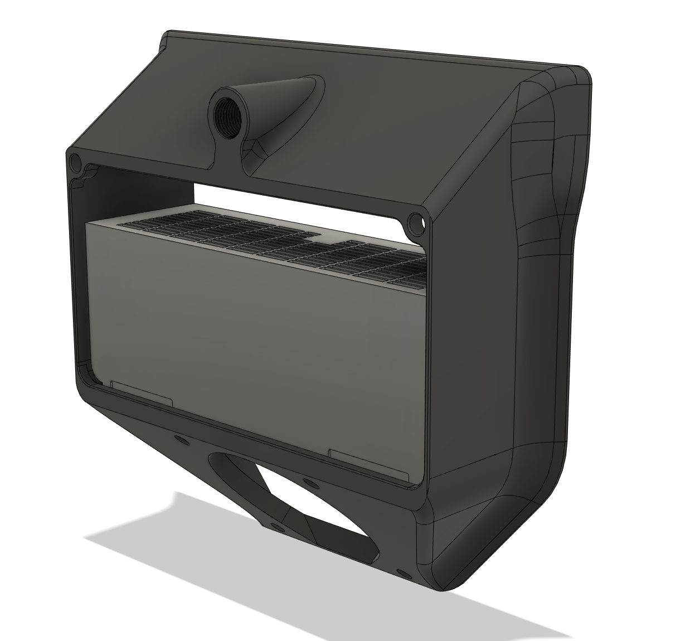
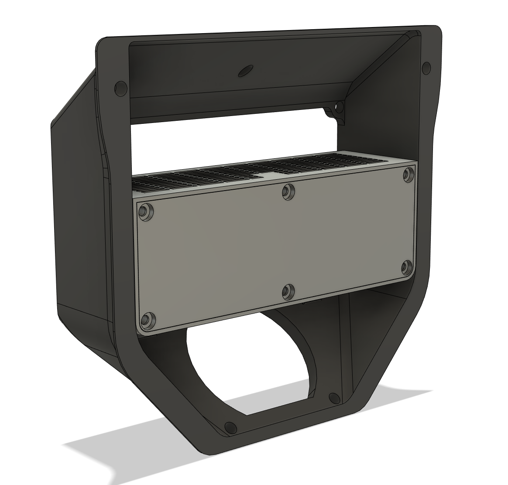
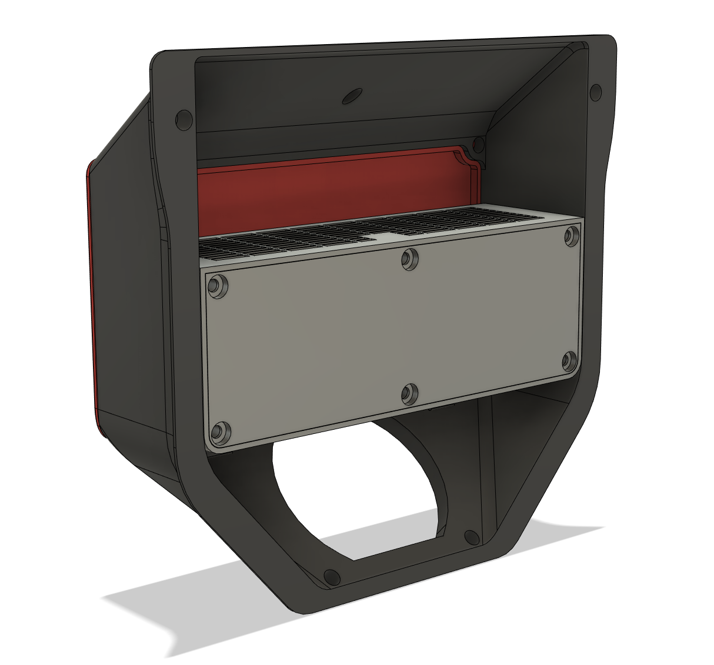

# Filter

This filter slide in the exhaust chamber of a voron 2.4r2

## Slinding box

This box can use nevermore carbon pellet. To increase a tight seal, you can use 1mm foam inside the exhaust system and on the voron panel (between the box lid and the voron panel).

CAD files: [cad](./CAD/)

STLs files: [stl](./STL/)

BOM:
- m3x6 BHCS x 6
- heat insert x 6

## Images

Final results

