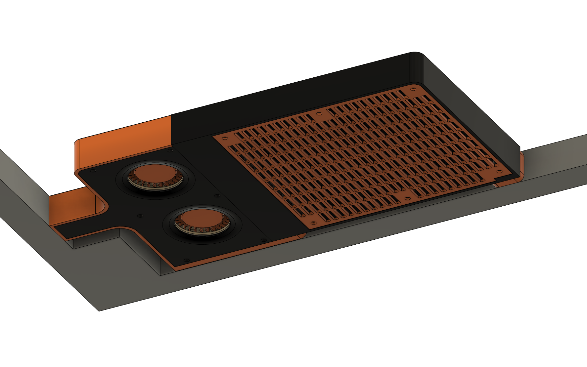
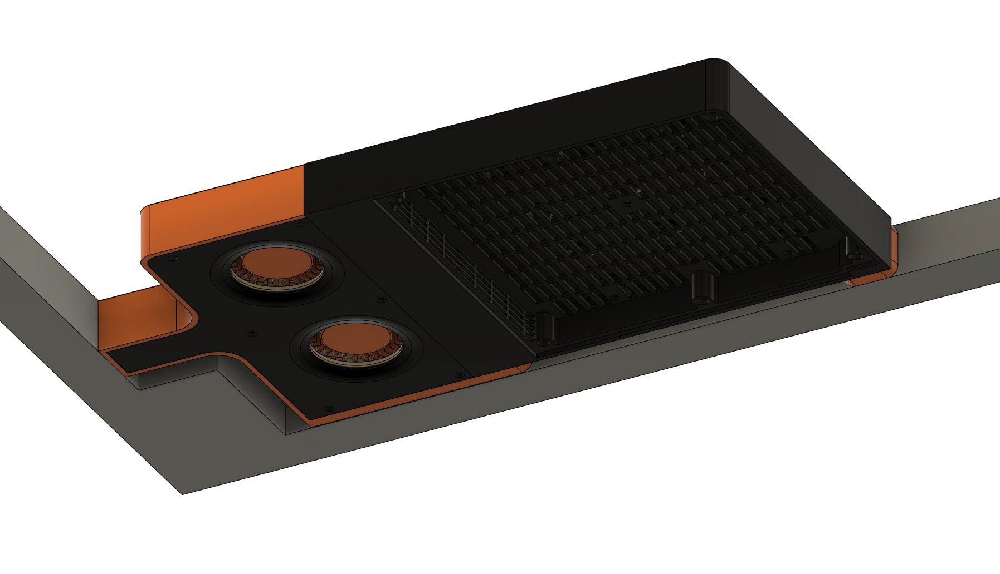
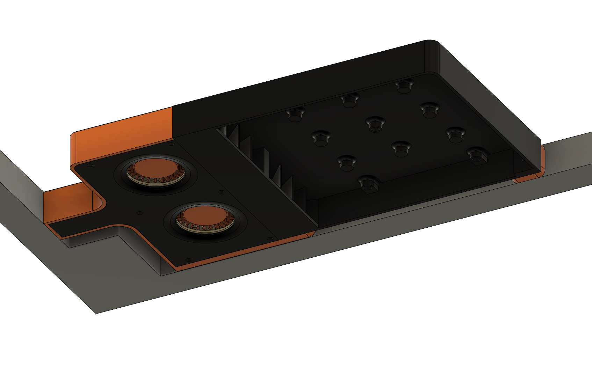
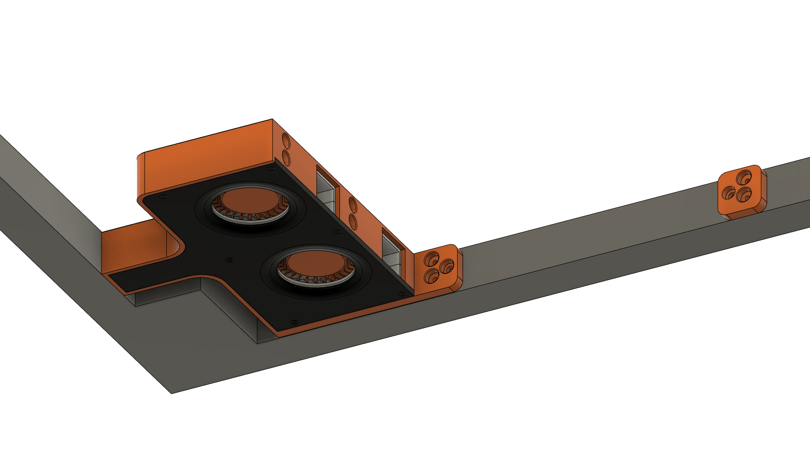
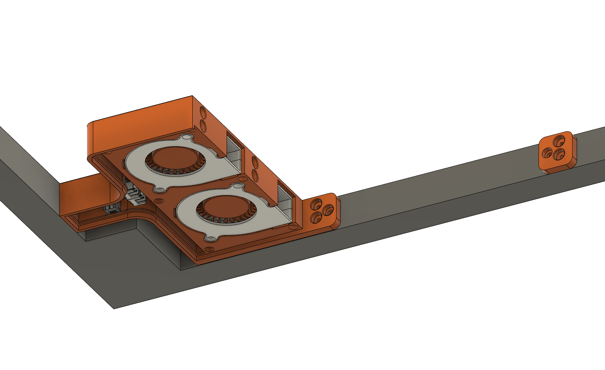
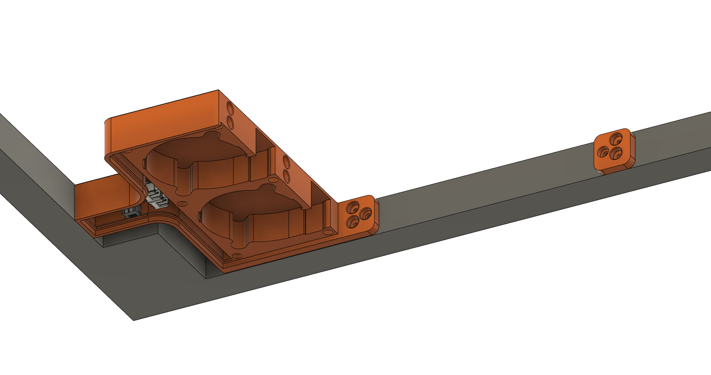
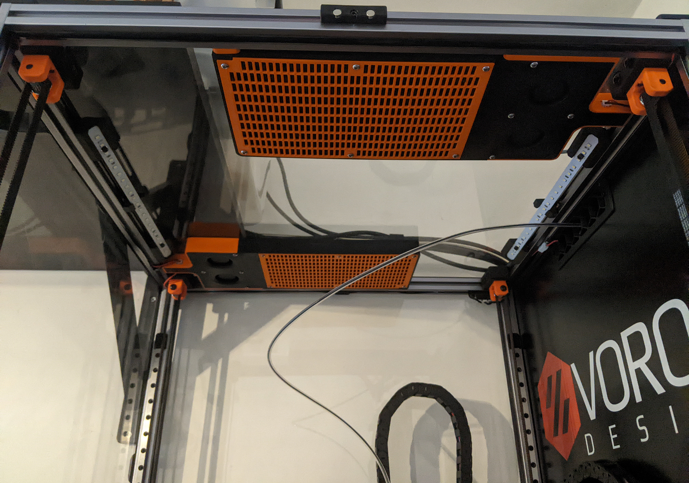

# The Bad Breath

This is a system that filter the air with the minimal possible air flow restriction. It use carbon pellet.

The bad breath anchor to the top of the printer and can be chained to get multiples _bad breath_ driven by the same source cable.

## Medium size

This box can use nevermore carbon pellet.

STLs files: [stl](./stl/)

CADs files: [cad](./cad/)

Gerber files (option PCB): [kicad](./kicad/the_bad_breath_fan_pcb/fan_pcb/gerbers_fan_pcb/gerbers_fan_pcb.zip)

BOM:
- m3x6 BHCS x 13 (+4 if using the PCB)
- m3x8 SHCS x 2
- heat insert x 21
- magnets 3x6 x 16
- 2x 5015 fan

BOM (optional PCB):
- JST-XH 2pin (Horizontal) x 4

## Large size

Soon.

## Images

Final results

