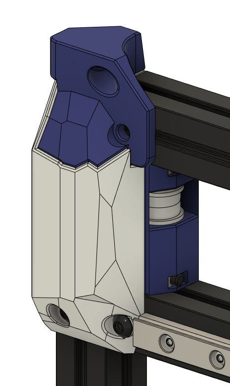
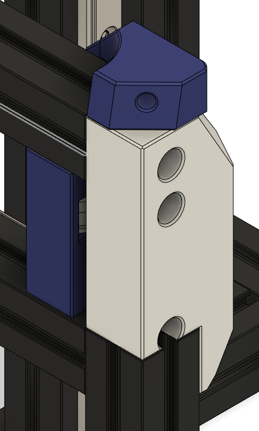

The design of these front mounted tensioners prevents the use of the stock tophat lower corners. As such, modified lower corners are included here with a matching aesthetic.

BOM
---
| QTY | Part | Comments |
| --- | --- | --- |
| 6 | M3x8 BHCS | 4 of these can be reused from the top hat lower corners and the rail stops |
| 2 | M3x10 BHCS | You can reuse these from the stock front idlers |
| 2 | M3x12 BHCS | You can reuse these from the stock top hat lower corners |
| 4 | M3x20 BHCS | |
| 8 | M3 Hex Nut | 4 of these can be reused from the top hat lower corners and the rail stops |
| 2 | 3x14mm Pin | |
