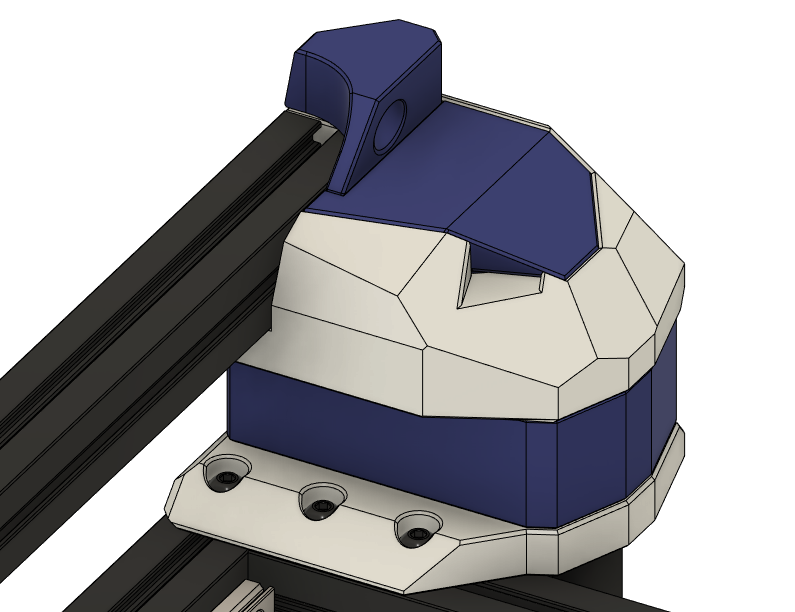

BOM
---
| QTY | Part | Comments |
| --- | --- | --- |
| 8 | M3x8 BHCS | 2 of these can be reused from the stock top hat lower corners |
| 2 | M3x10 BHCS | You can reuse these from the stock motor mounts |
| 12 | M3x25 BHCS | |
| 4 | M3x35 BHCS | You can reuse these from the stock motor mounts |
| 8 | M3 Hex Nut | You can reuse these from the stock motor mounts |
| 8 | M3 Threaded Insert | |
