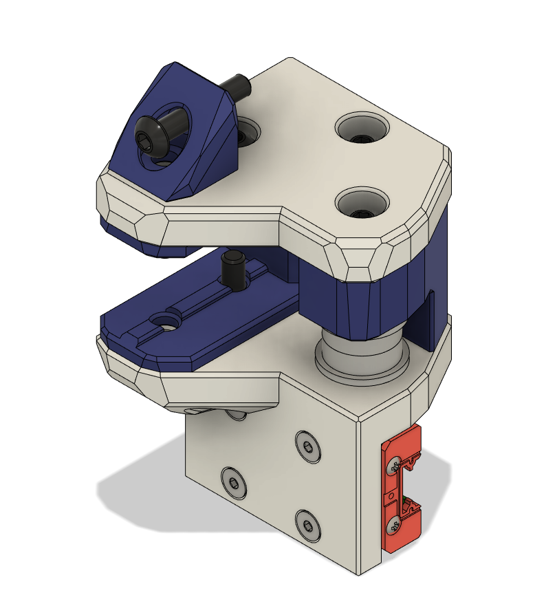
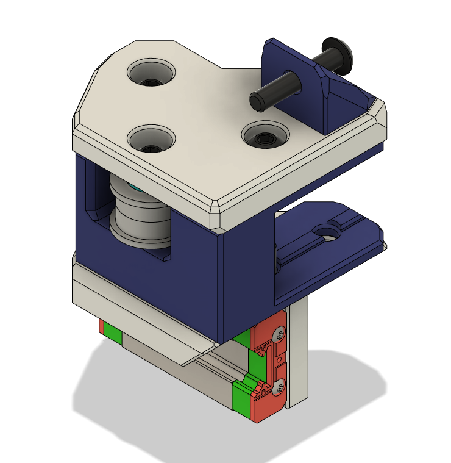

The directories here should be fairly self explanatory. The X endstop bumper will work with either design, but be mindful that you may need to adjust the orientation of your Endstop in order to ensure that the trigger button impacts the bumper. Improper orientation will prevent the switch from triggering.

