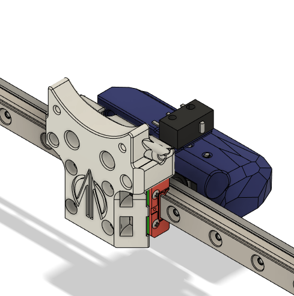
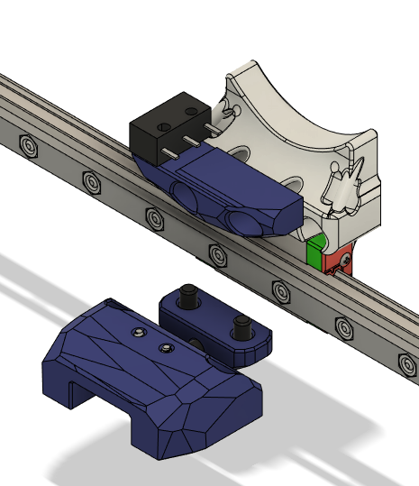

These parts are only needed if you intend on front mounting the linear rail for X travel. If you will be sticking with a top mounted linear rail these parts will not fit or will not line up properly.

It is also important to note that the linear rails for Z motion (the ones the bed attach to) will need to be moved up by ~2mm for optimal positioning.

The X Carriage design originated from the Micron and was adapted to align with my vision for this project. All credit for the original design goes to those that worked on this project: https://github.com/PrintersForAnts/Micron

BOM
---
| QTY | Part | Comments |
| --- | --- | --- |
| 4 | M2x6 BHCS | You can reuse these from the stock X-Carriage |
| 3 | M2x10 Self Tapping Screw | You can reuse these from the stock X-Endstop and Y-Endstop Bumpers |
| | | 2 required if only installing the Y-Endstop Bumper (for adjustable Y home) |
| | | 1 required if only installing the X-Endstop Bumper (for adjustable X home) |
| 4 | M3x6 BHCS | Only required if installing the Y-Endstop Bumper (for adjustable Y home) |
| 2 | M3x8 BHCS | Only required if installing the X-Endstop Bumper (for adjustable X home) |
| 1 | M3x12 SHCS | Only required if installing the Y-Endstop Bumper (for adjustable Y home) |
| 4 | M3 Hex Nut | 2 can be reused from the stock motor mounts (the StealthZero motor mounts only use 3 each along the top supporting rail) |
| | | Only required if installing the Y-Endstop Bumper (for adjustable Y home) |
| 5 | M3 Threaded Insert | 3 Required if not installing the X-Endstop Bumper (for adjustable X home) |
