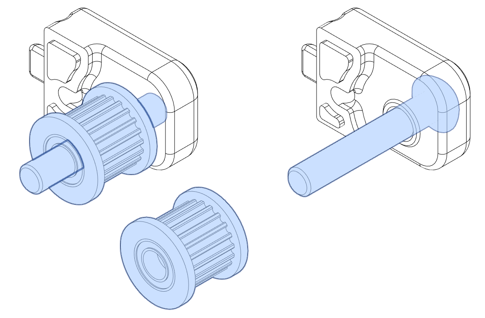

# 2-Piece Z Tensioners

Frustrated by a number of cracked stock Z tensioners, I finally decided to take matters into my own hands. The print orientation of the stock Z tensioners puts the most force along the layer lines which can easily result in delamination under normal use. These 2-piece tensioners change the print orientation so the forces being applied are perpendicular to the layer lines, resulting in a stronger part.

BOM
---
| Category | Part Description | Qty | Notes |
| --- | --- | --- | --- |
| | M3x25 BHCS | 4 | |
| | M3 Brass heatstake inserts - short M3x5x4 | 4 | |

# Assembly

Before We Begin
---
Make sure that you have the proper parts printed for your setup. If you're using the BOM hardware (M5x30 BHCS) make sure you don't have the internal flange.

Heatset Insert
---
Each tensioner assembly requires a single heatset insert that will be used in combination with an M3x25 SHCS to clamp the two pieces together.

Idler Shaft
---
BOM - Feed the M5x30 BHCS through the from the outside of part 'b' (as outlined in the naming convention) 
PIN - Press the 5x28mm pin into the pocket of part 'b' (as outlined in the naming convention)

Idler Installation
---
Push the GT2 20T Idler onto the pin or screw that you installed in the previous step.

Two Become One
---
Insert the M3x25 SHCS into the hole and use it to clamp the assembly together. For BOM hardware you'll first want to tighten the M5x30 BHCS as the threads have likely butten into plastic and will be harder to turn.

Tensioning Screw
---
Last, install the M3x16 SHCS that is used to tension the belts against the stock tensioner housings.

Once each of these tensioner assemblies have been completed, you're ready to install in your V2!