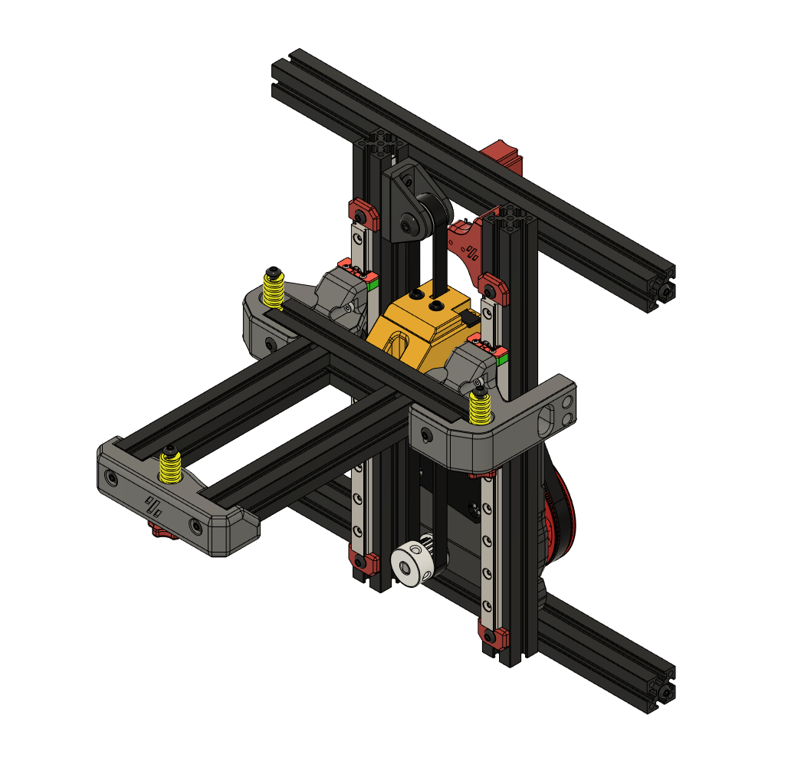
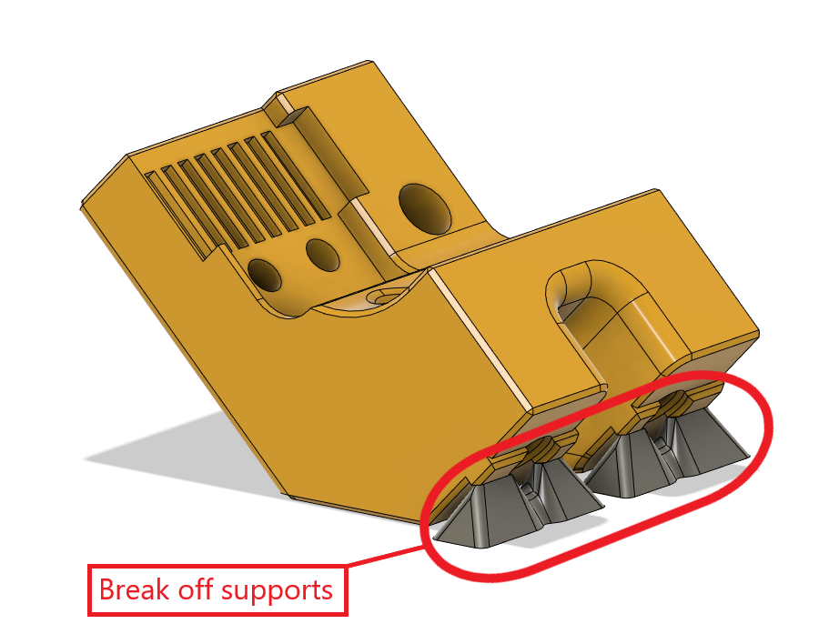
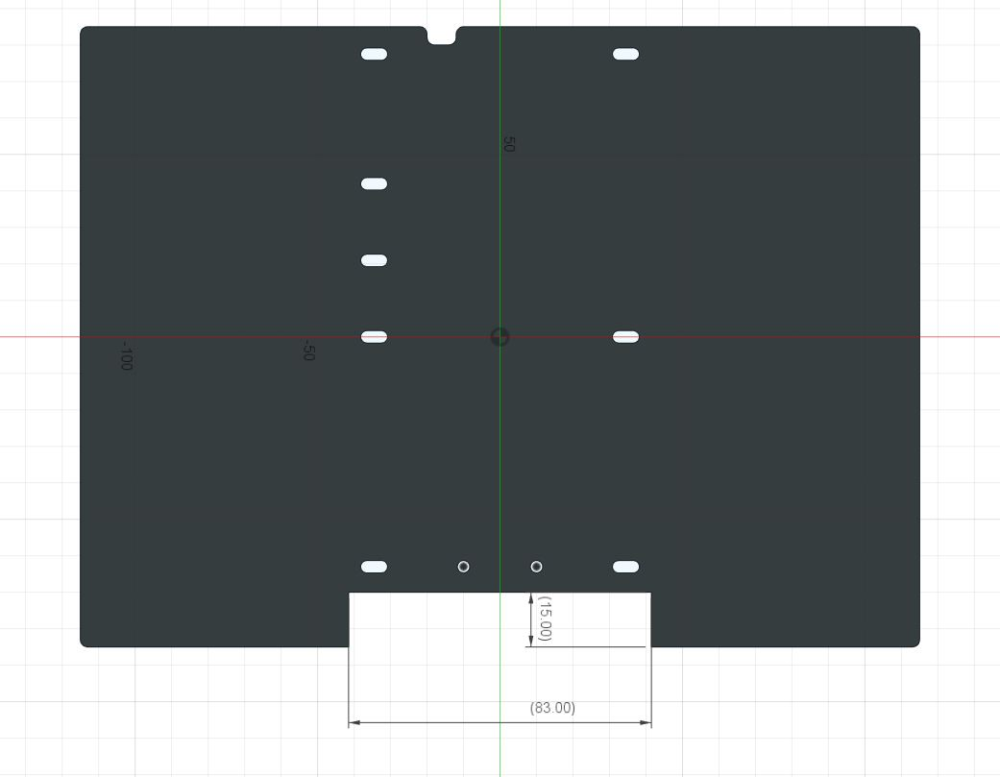
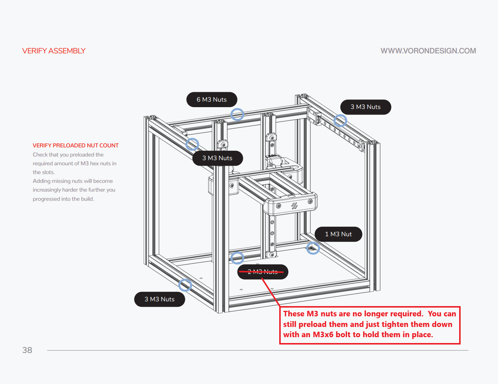
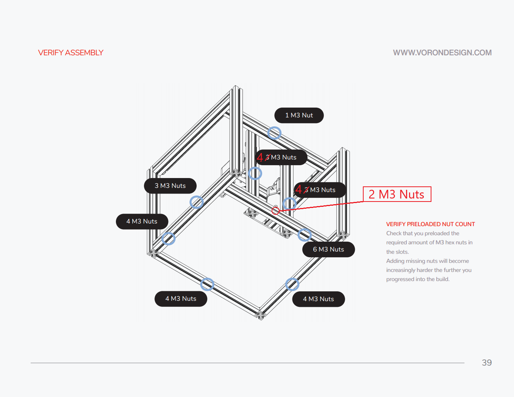
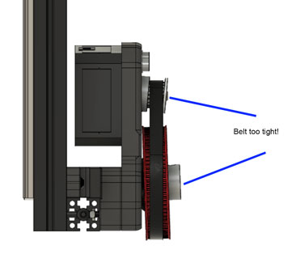
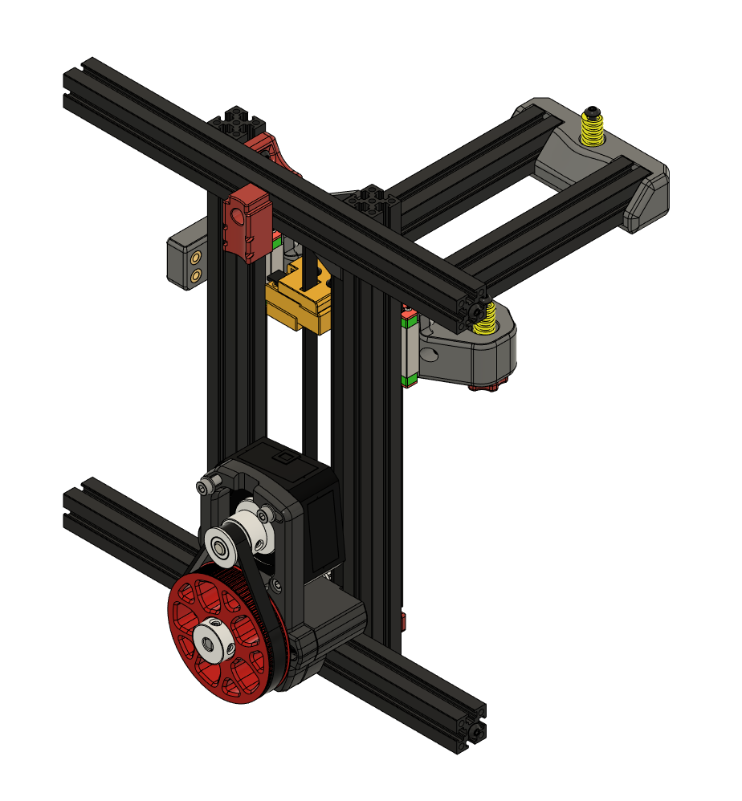
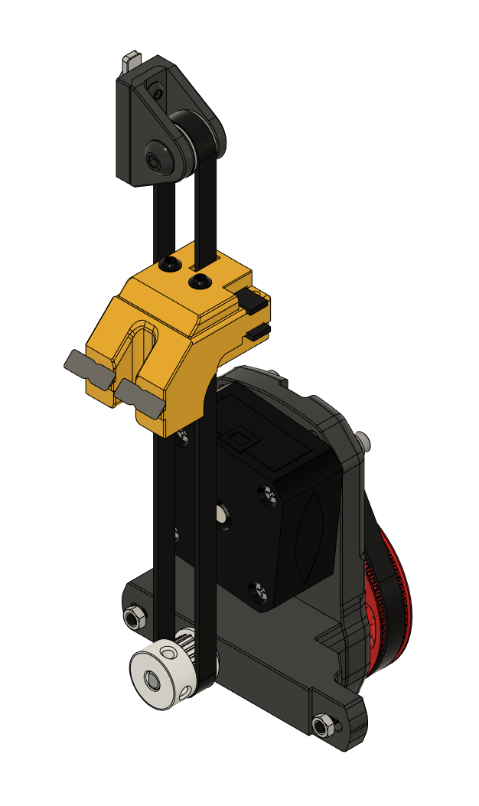
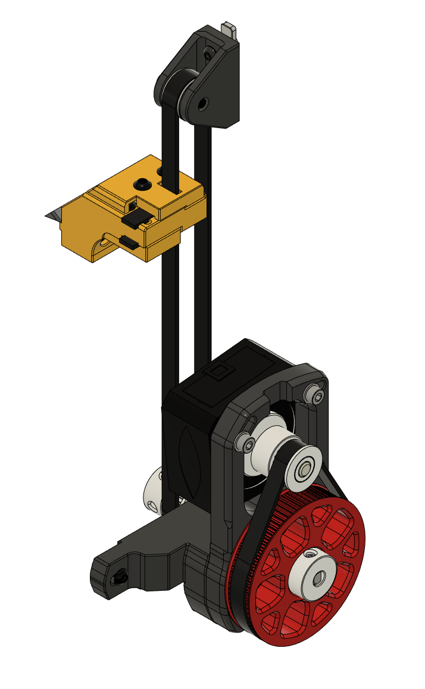

Adapted version of [FPVGeek's Belted Z Drive](https://github.com/theFPVgeek/VoronUsers/tree/master/printer_mods/theFPVgeek/v0-zbelt-mod) mod for the Voron V0.1 which uses the M4 extruder as base.  

<b>As with the original, this is a beta release. </b> Still testing and some minor design changes may happen in the future.

# NOTICE:
The belt clamp/bed mount part accounts for the 3.2mm shift forward for the bed of the V0.1 when compared to the V0.0.  These parts have also been modified for the mid-plate clearance issues that some users faced with the V0.0 version.  This design was created to use the same mounting points as the V0.0 leadscrew assembly so use those M3 nut placements in the extrusions.

<b>Design Notes</b>
* Designed to take advantage of the 4:1 gearing to prevent the belted Z / bed from dropping when motors are powered off.
* Created to be a drop-in replacement of the V0 leadscrew with a minimum amount of disassembly.
* Belt intensionally offset to the side, which attaches to and moves the bed, centering the belt.  Additionally, this keeps the end-stop screw in the same stock location to retain the use of the stock Z-end-stop
* Designed the bottom mount to utilize V0.0 M3 nuts already in the 1515 extrusions. For a V0.1 you'll need to add one extra M3 nut in the back of each Z rail extrusion and two in the rear of the rear bottom extrusion.
* Optional bottom panel filler can also be used for this version.

* V0-zbelt-BEDMOUNT_MODIFIED_V0.1 has built in supports that need to be removed.

* The mid panel will need a cutout in the bottom to make room for the z drive assembly.  The cutout doesn't need to be exact there just needs to be room for the z drive.  Dimensions are approximately 83mm wide and 15mm tall centered on the bottom.

# Klipper Stepper Settings:

<b>Old format:</b>
step_distance: .003125

<b>New format:</b>
rotation_distance: 40
gear_ratio: 80:20
full_steps_per_rotation: 200
microsteps: 16

For an OMC 17HS08-1004S (Spec Clockwork motor)
run_current: 0.5
hold_current: 0.4

# Assembly Order

***These assembly instructions assume you are assembling a new build.  If you are converting a prebuilt V0.1 that is using an integrated lead screw you will likely need to disassemble the frame to install extra M3 nuts***

Step 1 - As you're building the printer frame, you'll need to check that you have M3 nuts in the following locations and then just get to page 56 of the V0.1 manual.

Step 2 - Put the frame front facing down.  Mount the V0-zbelt-BEDMOUNT_MODIFIED_V0.1 to the center of the rear bed extrusion.  Then mount the mid panel.

Step 3 - Press two MF105-2RS bearings into the V0-ZBelt-FrontBottom-Bracket.  Mount the V0-ZBelt-FrontBottom-Bracket using an M3x10 on the left side.

Step 4 - Place a 20 tooth GT2 pulley at the end of the 70 or 72mm shaft with the set screw end flush with the end of the shaft.  Place one of the Printed-PulleySpacer-x2 against the toothed side of the pulley and push the shaft through the MF105 bearings until the printed spacer makes contact.  The pulley should now be on the inside of the printer.

Step 5 - Place a GT2 pulley on the motor shaft with the toothed end away from the motor.  Exact placement will be adjusted once the 80 tooth gear and 188mm belt are in place.

Step 6 - Assemble the top idler.  You can use any of the idlers listed in the original design files.  Mount the top idler.

Step 7 - Mount one end of the drive belt into the bottom clamp using V0-ZBelt-BeltClip-Bottom_MODIFIED_V0.1.  Route the belt though the top idler and back down to the bed mount.  Feed through the bed mount top clamp, secure clamp.

Step 8 - Slide the top idler block upwards to get the belt tension to the tension you'd like and tighten the mount screws. This can be adjusted later more after assembly.

Step 9 - Mount the stepper motor loosely to the V0-ZBelt-Pancake-Stepper-Bracket.  Screws will be fully tightened later to tension the 188mm GT2 belt.  

Step 10 - Press an F695-2RS bearing into V0-ZBelt-Pancake-Stepper-Bracket.  Mount V0-ZBelt-Pancake-Stepper-Bracket with the stepper motor attached to V0-ZBelt-FrontBottom-Bracket.

Step 11 - Place the other Printed-PulleySpacer-x2 onto the open end of the 70 or 72mm shaft.

Step 12 - Mount the 80 tooth gear.  If using a printed gear you'll need to remove the flange from a GT2 pulley using pliers or a bottle opener, press the pulley into the printed 80 tooth, and afix with 5 M3x8 BHCS bolts as with the M4 extruder.

Step 13 - Put the 188mm GT2 belt loop on the 80 tooth and 20 tooth mounted to the stepper.

Step 14 - Tighten the 188mm belt be rotating the stepper motor until snug but not overtightened and then tighten the motor mount screws.  

Step 15 - Verify the belt is aligned vertically and verify bed moves up and down freely with belt remaining in line.

Step 15 - Mount controller board and pi using either screws or VHB tape.

Step 16 - Wire up Stepper motor

Step 17 - Change Klipper settings to values shown above.

Step 18 - Retension Belt / Top Idler Bracket mount if neccessary.

Step 19 - Test (please start slow) and enjoy.

# Addtional Pics:

