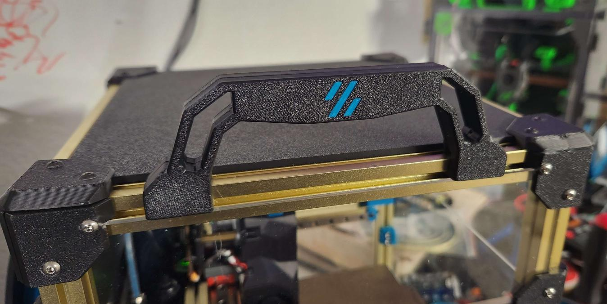
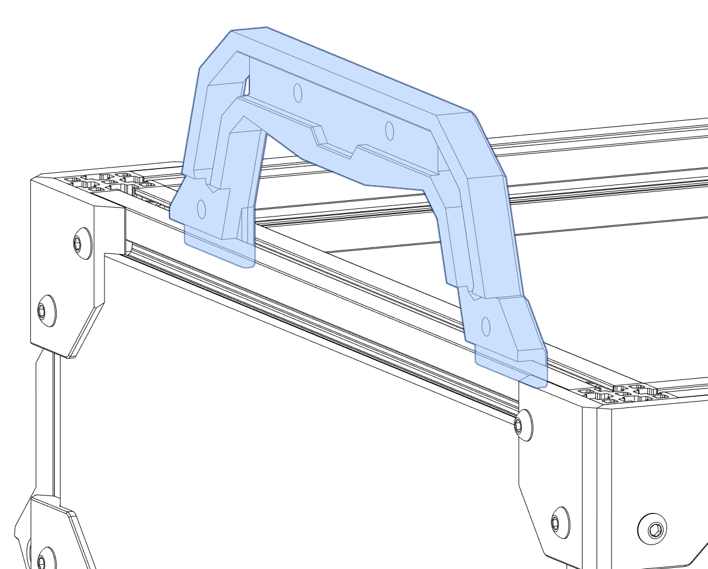
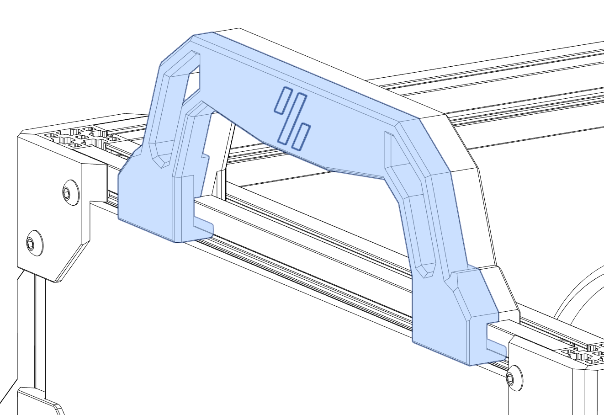
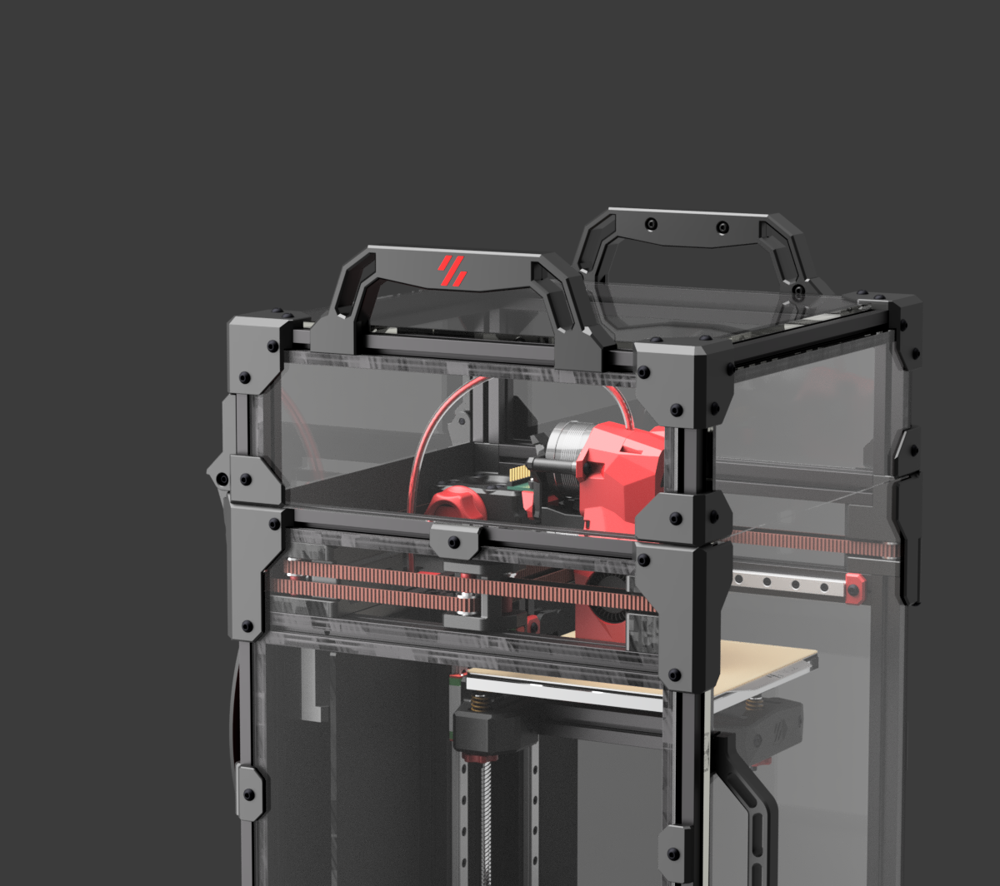
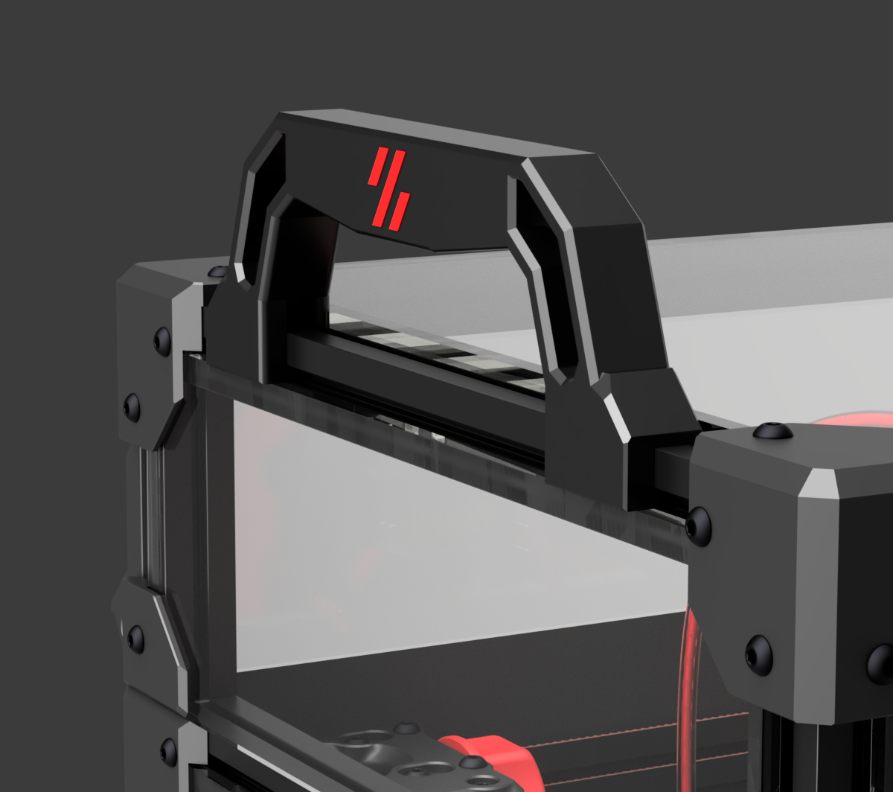

# V0.2 Handles

### Add handles to the extrusion tophat so you can sling that thing around. Easy to install, just follow the below steps. 

### *NOTE - remove the top panel before you proceed. Replace panel once install is complete.*  
 
 

## Step 1  
---
### Insert "Part A" into extrusion, vertically.

 
 
 

## Step 2
---
### Insert "Part B" into extrusion, horizontally (after you've installed the logo insert).

 
 
 

## Step 3
---
### Bolt that bad boy on.

 
 
### That's it! Replace your top panel and get back in the game.
 
 

