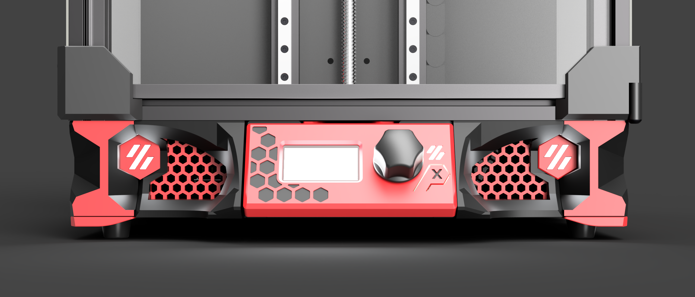
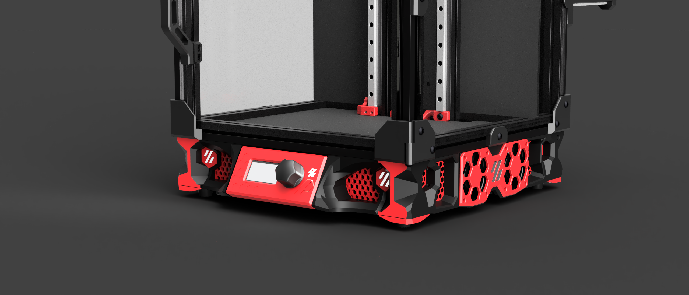
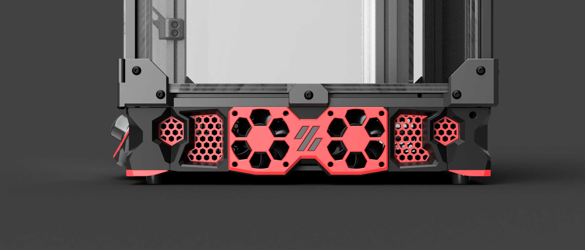
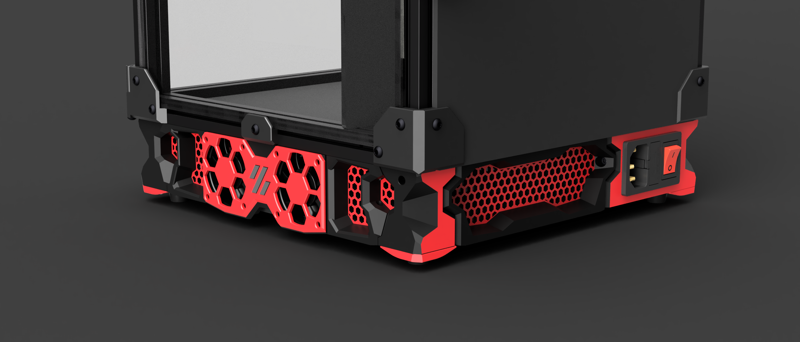

# V0.2 Stealth Skirts
Shout out to **hartk** for iniating this project and to **meteyou** for putting the final touches on it. 

- All skirt parts are single bodies - to achieve the look below, use of color swap is needed. 
- There are two versions of the side fan grills - one for 4010 fans and one for 3510 fans. 
  - 4010 fan version does **not** allow the use of an electronics bay panel, while the 3510 version does. 
- No additional hardware (outside of your choice of fans) is necessary.

