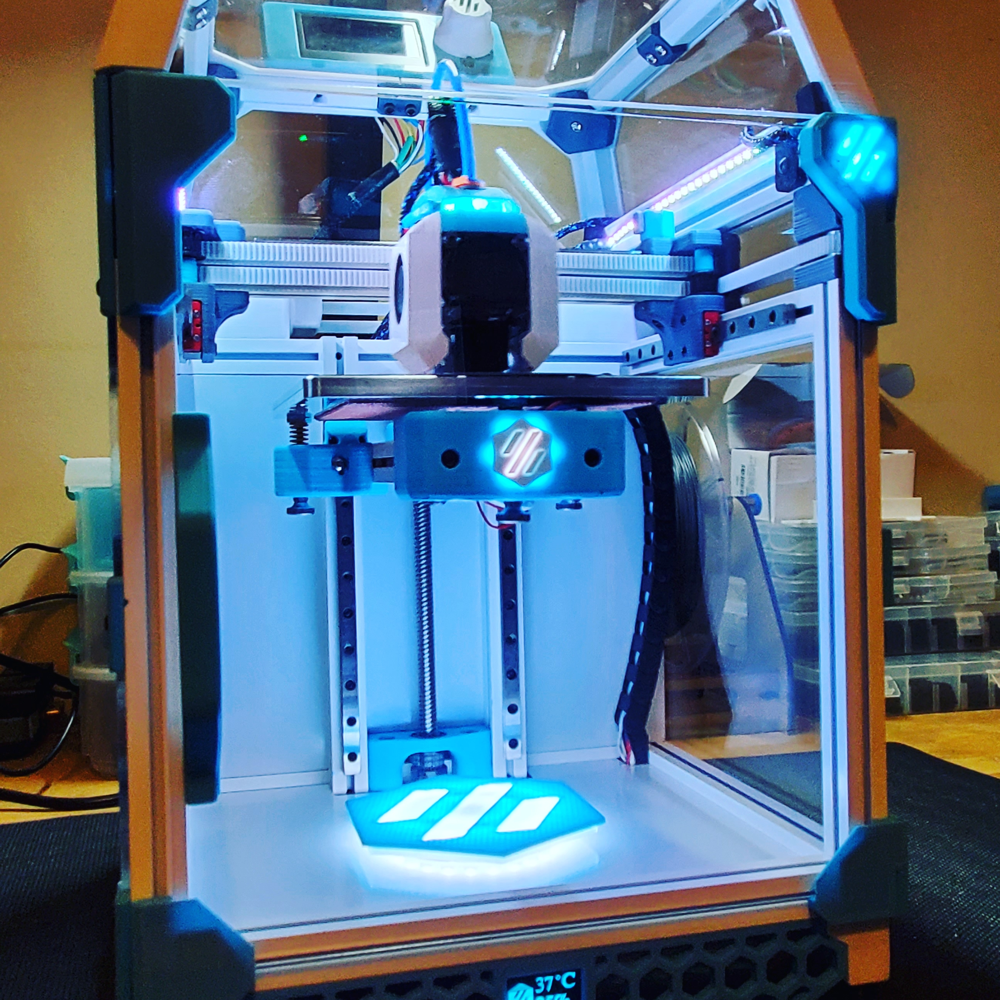

# V0 Illuminated Deck Logo

A lower deck panel addition to the V0, designed to accomodate a Neopixel Ring.

## Print

There are three files to print with pictures that show the order in which they're placed. The "Deck Logo Insert - Transparent" file is printed with a clear filament to allow for the glow that is represented in the pictures.

## Assemble and Install
The parts are attached to one another using an adhesive like super glue. The assembly is then attached to the lower deck panel via VHB tape.

## LEDs
I used two Neopixel Rings (a 24 and a 12) in my build, but only one is required. VHB tape was also used to secure these to the deck panel. I then drilled a hole through the deck to accomodate the wires necessary to run to an Arduino Nano as a controller. 

## Controller
The lights can be controlled with an Arduino Nano, Klipper, or an Octoprint Plugin. 

