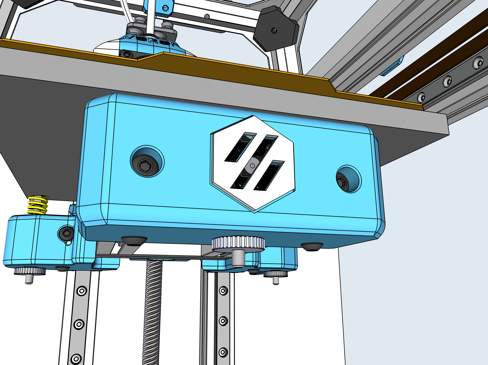

# V0 LED Front Bed Mount

This modification was designed to accomodate a Neopixel Jewel (7) in the face of the mount. Wiring is ran to the cable chain and ultimately to an Arduino Nano as a controller.

The file "LED Front Bed Logo" was printed in a different color and added to the mount using an adhesive. 

The lights can be controlled with an Arduino Nano, Klipper, or an Octoprint Plugin. 

