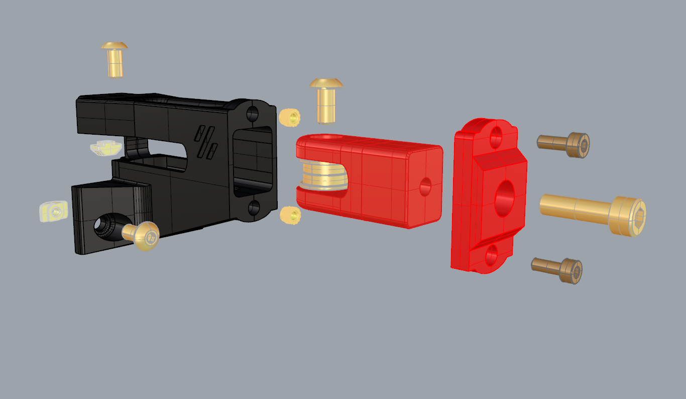
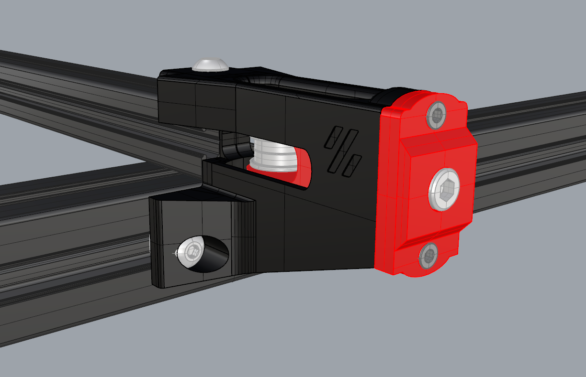

This mod for Voron Switchwires Y axis Belt tension, you don't need cut panels

Fasteners

- 2x M3x8mm SHCS
- 2x M5x10mm SHCS
- 1x M5x10mm BHCS
- 1x M5x16 up to 20mm for tensioner
- 2x M5 T-Nut (For 3030)
- 1x M5 T-Nut (For 2020)
- 2x M3 Threaded Insert

Use Allen key for tensioning your belt, You can use brim while printing "Body" part

Have a good print (:

Photos might be different from STLs because of updates. Latest and tested parts are ready for your download.
