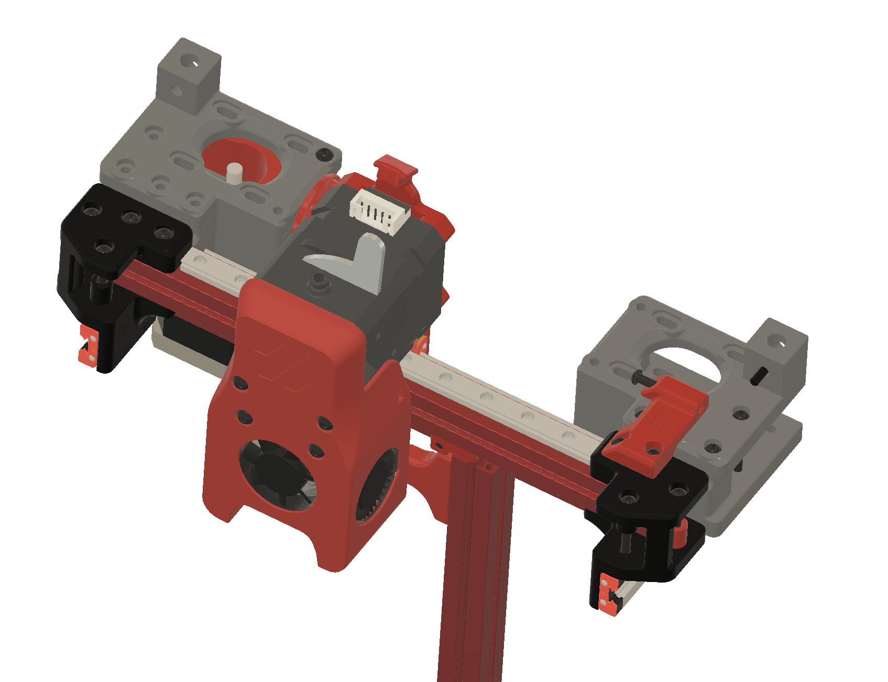
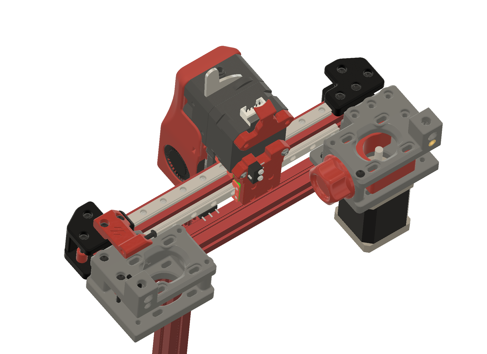

V0.1 mod for mounting Bondtech LGX extruder with addition of 2nd X rail on the back of the 1515 extrusion. 
Already tested the rigidity of the 2nd rail and there is no up and down tool head movement as with just one. 

