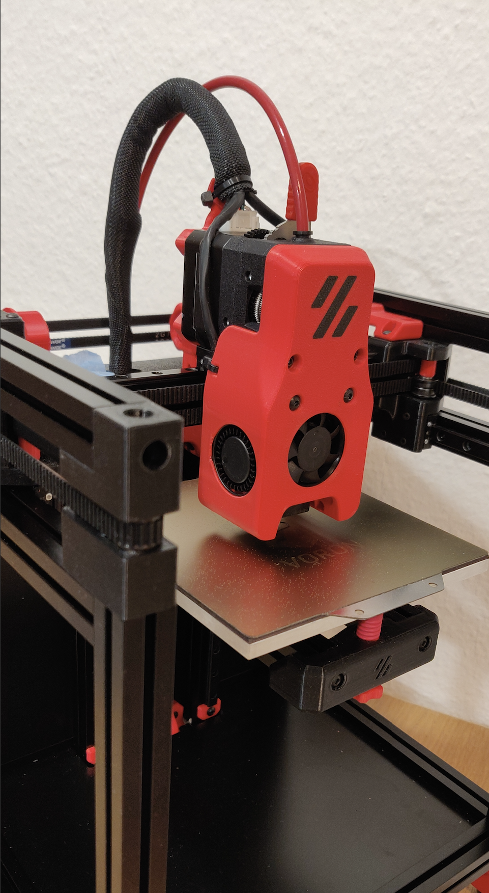
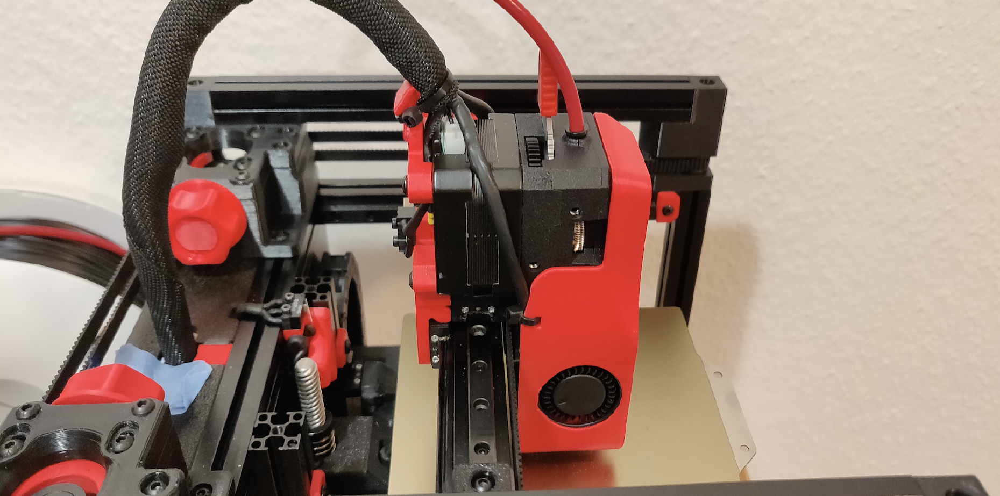
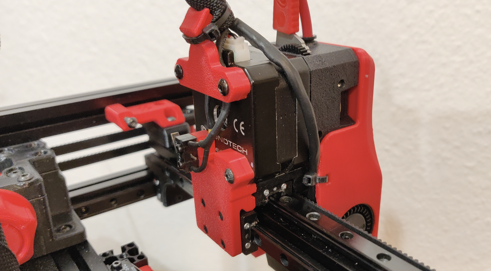
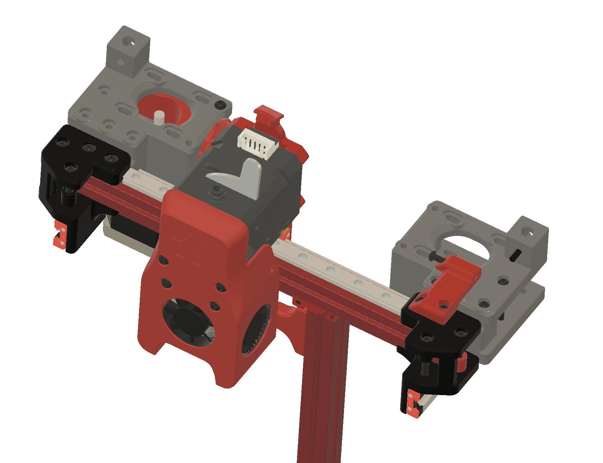
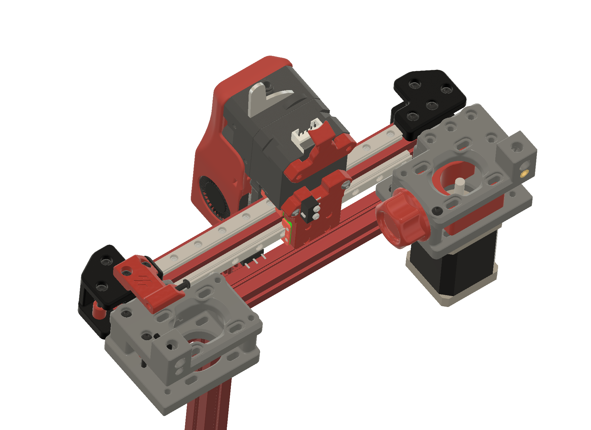

V0.1 mod for mounting Bondtech LGX extruder with addition of 2nd X rail on the back of the 1515 extrusion. 
Already tested the rigidity of the 2nd rail and there is no up and down tool head movement as with just one. 

For the X end stop bumper, one screw is enough, the 2nd is optional and the one holding the extrusion does not need to be removed.

Few additional screws are needed:
- X bumper 1x M3x10 or 1x M3x12
- Y Bumper 1x Mx6

Strain Relief 
- 2x M3x8

Carriage Backplate 
- 1x M3x6 
- 1x M3x8 
- 4x M2x6

A Motor Mount 1x M3x8
B Motor Mount 1x M3x8

Cowling 
- 2x M3x30 (LGX mount)

The LGX Interface Plug is integrated in the Cowling 

LGX Extruder 
- 2x M3x16 (bottom of the extruder)

The Carriage Backplate can be optional mounted with 3 M2x16 screws to the carriage, the holes are covers and need to be cut out. It is not necessary to use them, there is enough rigidity as the backplate is directly mounted to the LGX stepper.

You will also need 1x 150mm MGN7, I don't recommend w/o the 2nd rail, even with good rail, the tool head will wobble after a while even with original mini AB.

