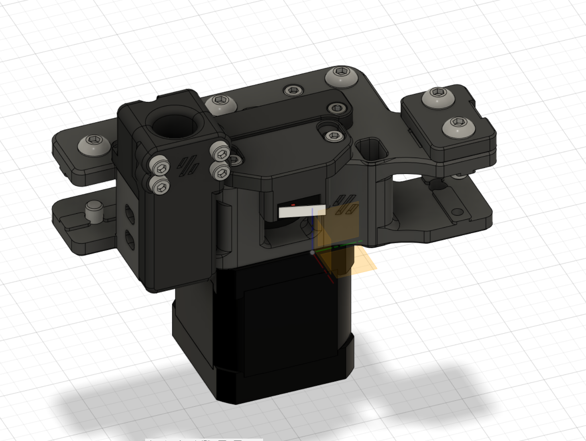

# Rear Umbilical Addon and Y Endstop Relocation

| BOM | Pieces |
| ------ | ------ |
| M3 Heatinsert | 4x |
| M3x10 SCHS | 4x |

since my a/b motor mounts are MJF single pieces i needed a way to add umbilical compatibility without the need to reprint anything. so i designed this.
its however heavily based on Selliot79's Design. i just designed it to be a bit smaller, to fit a IGUS CF5.05.18 perfectly and moved the mountings to the rear, so theres space for a [Y Endstop relocation](./Y_Endstop_Relocation) 

check out [Dustinspeed's Stealthburner Umbilical Cover](https://github.com/majarspeed/Misc-Voron/tree/main/StealthBurner%20Umbilical%20cover/), a great addition to this mod :)

