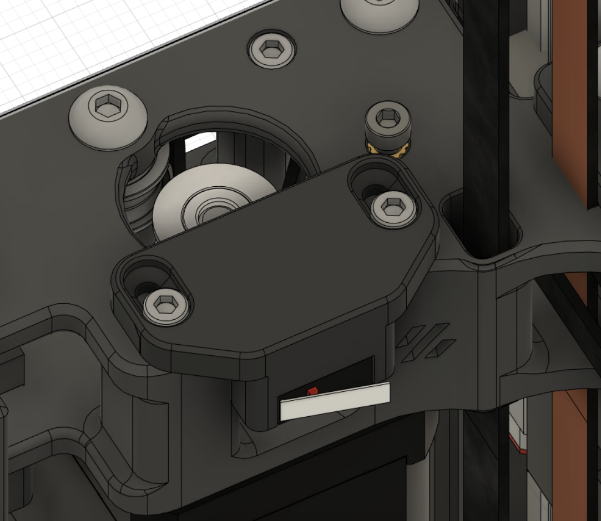

# Y Endstop Relocation.

| BOM | Pieces |
| ------ | ------ |
| M3x35  | 2x |

Once youll go Umbilical you need to relocate your Y Endstop.
my whole build ist printed in single-piece MJF's, so i did not want to reprint everything. 

figured im not alone with the last, so i designed this one.
Its position is the same as Hartk1213's Y endstop relocation but with the possibility to adjust it. 
