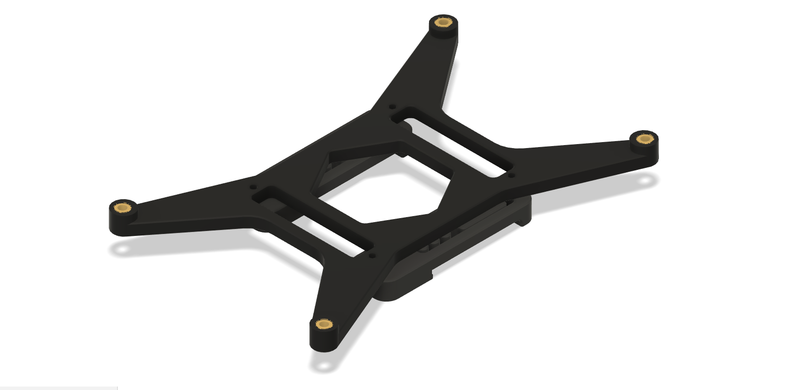

**SKR PRO 1.1 DIN mount**

This mod can be used in either direction by simply changing the din clips. The short standard ones supplied with the Voron CAD will allow the control board to mount lengthways along the din rail, the included stretched din clamps allow for a portrait style mounting. 

**Printed Parts:**
- 1x SKR PRO Mount
- 2x (either) Strected din clamps / Standard voron din clamps

**Hardware:**
- 4x M3 Heat inserts
- 4x M3 x 6 BHCS
- 4x M2 self tapers 

