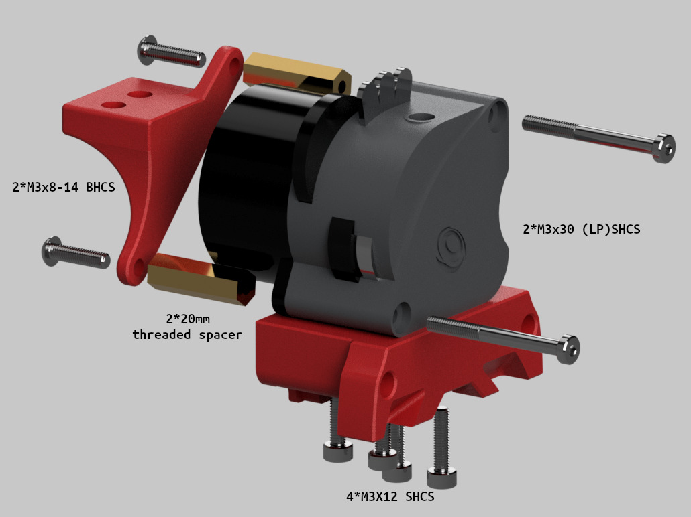

A mod to mount the LGX Lite to the current X carriage.

## Additional Hardware:
### LGX lite mount 
   - 4* M3x12 SHCS  
     - don't forget to install the included nuts with the LGX lite into the extruder housing.
   - 4* heatset inserts
### Chainmount:
  - 2* M3x30 SHCS 
    - low head to match the originals but regular work
  - 2* M3x20 threaded spacer
  - 2* M3x8-14mm BHCS
    - length isn't critical as long as it's between 8 and 14mm
  - 2-3* heatset inserts  

## Installation:  

  0. Install heatsets into printed parts.
  1. Remove the motor and install the nuts included with the LGX.
  2. Attach the LGX to the mount.
  3. Reattach the motor using the longer screws.
  4. Thread the spacers on the exposed screws behind the motor.
  5. Screw the chainmount onto the spacers.
  6. Attach to the carriage.

