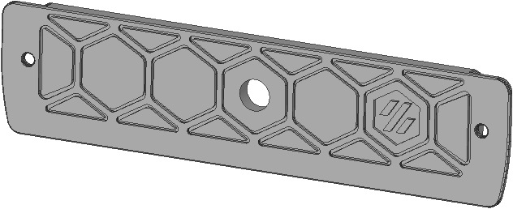
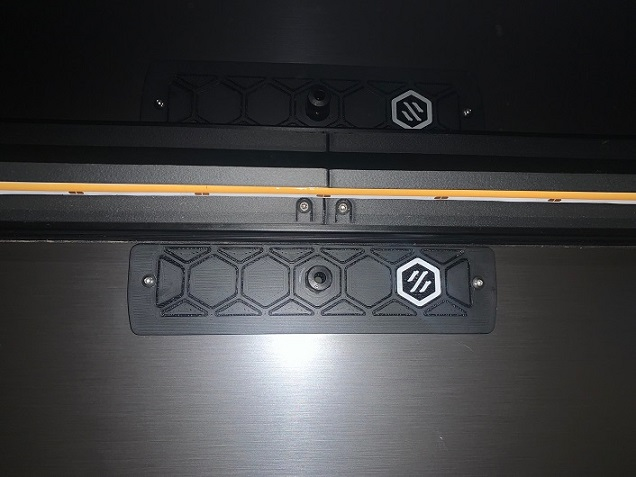
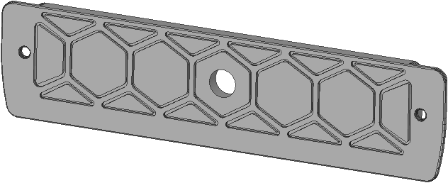
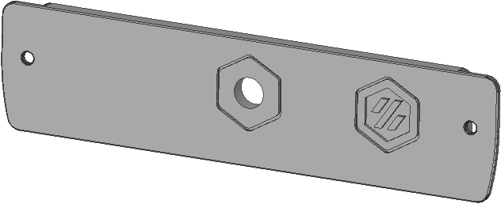
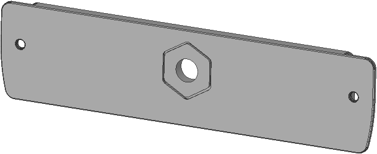

# Exhaust Grill Cover
Alternative closed grill cover for the backpanel with hole for M10 4mm OD tube connector
  

  

  

# Exhaust Cover Options

|exhaust_filter_grill_closed.stl|exhaust_filter_grill_closed_nologo.stl|
|:---:|:---:|
|  |  |

|exhaust_filter_grill_closed_flat.stl|exhaust_filter_grill_closed_flat_nologo.stl|
|:---:|:---:|
|  |  |

 

# BOM
|Size|Qty|
|---|:---:|
|M10 4mm OD push-fit-conector|1|

 

# Compatibility

|V0|V1.8|V2.4|VSW|Trident|
|:---:|:---:|:---:|:---:|:---:|
| :x: | :heavy_check_mark: | :heavy_check_mark: | :x: | :heavy_check_mark: |

 

# Changelog
v1.0 (21.10.2022) - Release
  
Discord: Nitro2k5#2432
