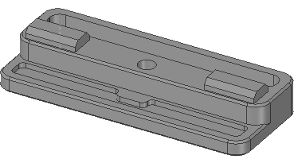

# Filament Runout Sensor Housing
Sensor Housing for Generic CHN Filament Runout Sensor
<br><br>

<br><br>

<br>

<br><br>

# Base Options
|filament_sensor_base.stl|filament_sensor_base_cableguide.stl|
|---|---|
|  |  |

<br>

# Cover Options
|filament_sensor_cover.stl|filament_sensor_cover_rotated.stl|filament_sensor_cover_nologo.stl|
|---|---|---|
|  |  |  |

<br>

# Panel Clip Adapter
If you are using stock panel mounting, you may need a panel clip adapter
<br>
|panel_clip_adapter_X.Xmm.stl|
|:---:|
|  |

<br>

# BOM
|Size|Qty|
|---|:---:|
|M3 heat set inserts|5|
|M3x20 BHCS|3|
|M3x16 BHCS|2|
|M3x8 BHCS|2|
|M10 4mm OD push-fit-conector|2|
|M3 T-Nut|2|

_Note:
<br>
BHCS is required due to the small design_
<br><br><br>

**Additional fasteners for Panel Clip Adapter:**

|Size|Qty|
|---|:---:|
|M3 heat set inserts|2|
|M3x8 SHCS|2|

<br>

# Config
Add the following code to your **printer.cfg**
<br>
```
[filament_switch_sensor filament_runout]
pause_on_runout: True
event_delay: 3.0
pause_delay: 0.5
switch_pin: <your pin>
#runout_gcode:
#insert_gcode:
```
_Note:
<br>
`runout_gcode:` triggers only on print active
<br>
`insert_gcode:` triggers only on idle_
<br><br>

# Compatibility

|V0|V1.8|V2.4|VSW|Trident|
|:---:|:---:|:---:|:---:|:---:|
| :heavy_check_mark: | :heavy_check_mark: | :heavy_check_mark: | :heavy_check_mark: | :heavy_check_mark: |

<br>

# Changelog
v1.2 (14.11.2022) - Adding Panel Clip Adapter, adding images, update BOM
<br>
v1.1 (31.10.2022) - Smaller design and -1 heat set insert
<br>
v1.0 (21.10.2022) - Release
<br><br>
Discord: Nitro2k5#2432
