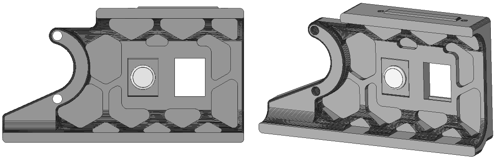
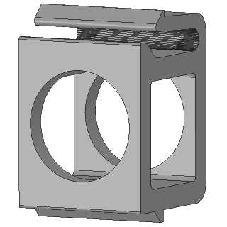

# Keystone Button Insert

Simple Keystone button insert for round 16mm switches. 

  

# File

|[a]_keystone_button_insert_16mm.stl|
|:---:|
||
 

# Compatibility

|V0|V1.8|V2.4|VSW|Trident|
|:---:|:---:|:---:|:---:|:---:|
| :x: | :heavy_check_mark: | :heavy_check_mark: | :x: | :heavy_check_mark: |

 

# Changelog
v1.0 (08.11.2022) - Release
  
Discord: Nitro2k5#2432
