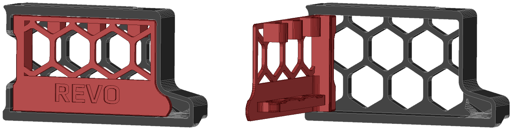

# Revo Nozzle skirt mod

Modification from this mod: 
https://github.com/VoronDesign/VoronUsers/tree/master/printer_mods/Daten/Voron_2.4_Revo_Nozzle_Holder

Referring to this fantastic mod, i was thinking, why shouldn't there be a version for the left side? So I simply mod it myself.

Available for the sizes 250, 300 and 350 mm.

Currently only designed for the Voron 2.4 R2, if there is interest in the R1 version, just let me know.

 

  

# BOM
|Size|Qty|
|---|:---:|
|M3x8 or M3x10 SHCS|2|

 

# Compatibility

|V0|V1.8|V2.4|VSW|Trident|
|:---:|:---:|:---:|:---:|:---:|
| :x: | :x: | :heavy_check_mark: | :x: | :x: |

 

# Changelog
v1.0 (27.10.2022) - Release
 
