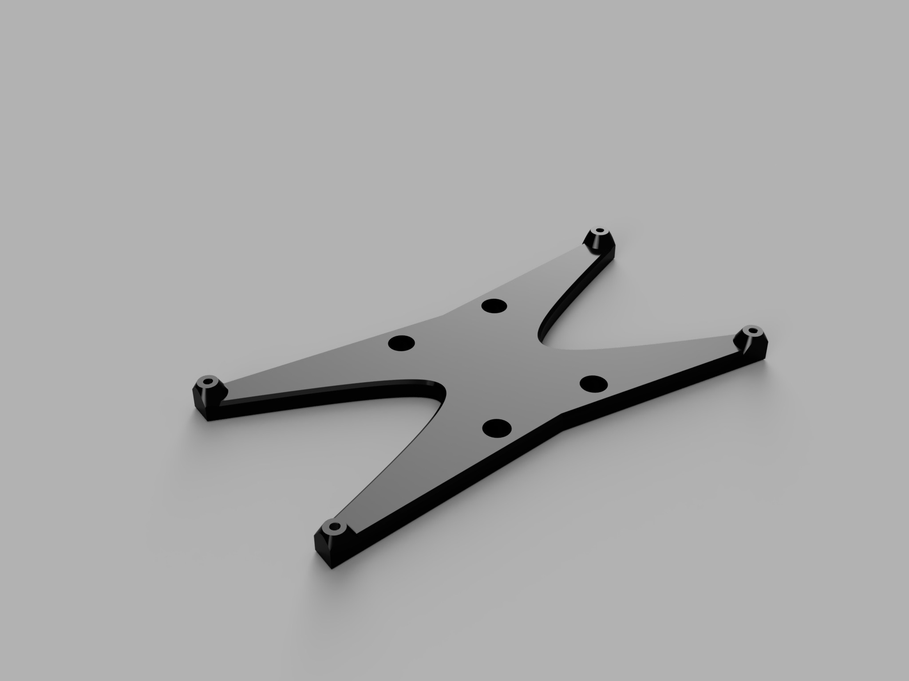
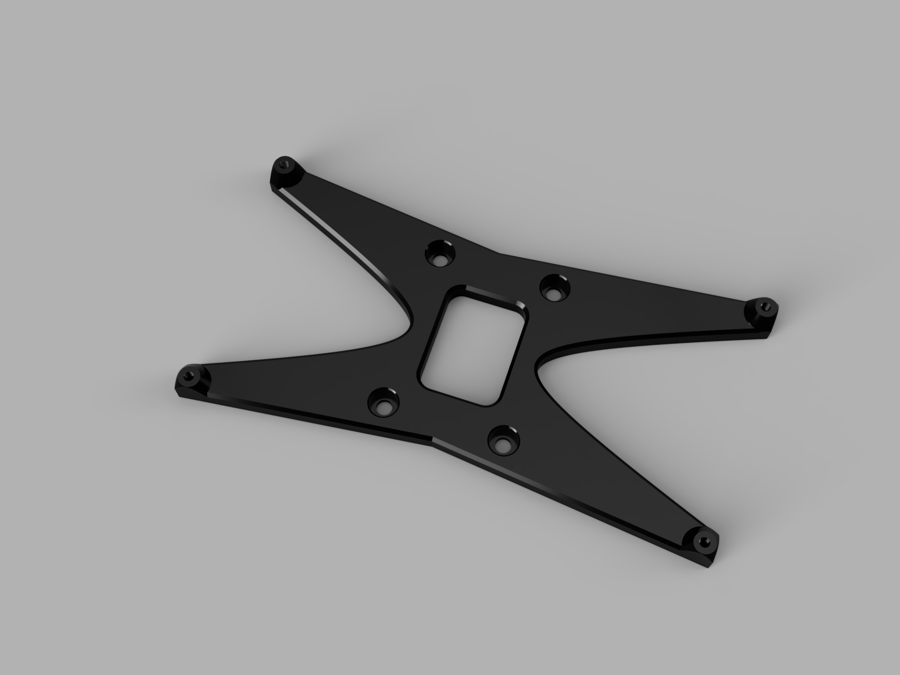

This is a mount for the FYSETC Spider using the sturdier metal DIN mount.
Two versions are available:

The standard "YASDM" - "Yet another Spider DIN Mount":

"Angry Starfish" (for all your print time optimized needs...):

Metal "SSR" DIN Rail Clips (35mm) can be found here:

* [Mechporium](https://mechporium.co.uk/products/ssr-din-rail-clip-35mm)

* [Fermio](https://fermio.xyz/en/electronics/solid-state-relays/286/ssr-din-rail-mounting-adapter)

* [AliExpress](https://s.click.aliexpress.com/e/_AXfvJ5)

* [AliExpress Alternative](https://s.click.aliexpress.com/e/_ACKGRh)
