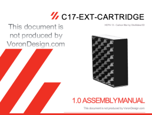

# C17 -EXT-CARTRIDGE, HEPA Carbon filter

The C17-EXT-CARTRIDGE is designed to be used with the C17-EXT HEPA Carbon filter.

This is a first publication, although all parts has been tested, there may be errors do not hesitate to contact me.

## Assembly Manual

# BOMs

The list of parts is described in the manual.

## HEPA 13 Filter

Use HEPA 13 filters from 10mm to 18mm thick. The best is to find a HEPA 13 filter for vacuum cleaner and cut it with a cutter. The references change according to the country.

I tested this one after cutting with a cutter : 

- The best but I do not find the reference in other countries: [Amazon.fr](https://www.amazon.fr/gp/product/B01MCTSXVR/ref=ppx_yo_dt_b_asin_title_o06_s00?ie=UTF8&psc=1)
 
 - [Aliexpress 1](https://fr.aliexpress.com/item/4000071269334.html?spm=a2g0o.productlist.0.0.574c118d9Bmk6H&algo_pvid=f6bc77a3-4082-4ada-840b-ccc360a0eb8a&aem_p4p_detail=202205140919487673921735755640028568333&algo_exp_id=f6bc77a3-4082-4ada-840b-ccc360a0eb8a-4&pdp_ext_f=%7B%22sku_id%22%3A%2210000000183120618%22%7D&pdp_npi=2%40dis%21EUR%21%219.53%21%21%211.99%21%21%402100bdec16525451882826492ee768%2110000000183120618%21sea)

- [Aliexpress 2](https://fr.aliexpress.com/item/4001298732898.html?spm=a2g0o.order_list.0.0.21ef5e5bHvenA3&gatewayAdapt=glo2fra)

## Carbon

WARNING : Although the C17-EXT does not return treated air to the printer enclosure, use Acid-free Activated Carbon (Coconuts for example : amazon) !

# Credits

The C17-EXT Activated Carbon Filter was modelled in [Fusion 360](http://autodesk.com).

## Contributing

A complaint is a gift. Please, help me to improve the C17-EXT-CARTRIDGE !

## License

Distributed under GNU General Public License version 3.0 (GPLv3)

## Contact

Discord: OboMaker3D#0669 - (<https://discord.com/user/OboMaker3D#0669>)

## Acknowledgements

[The Voron Dev Team](https://vorondesign.com/)
