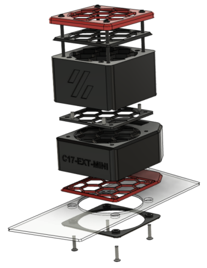
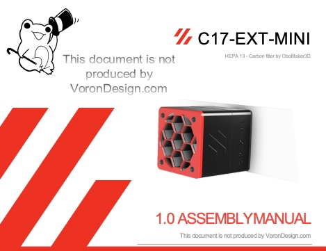

# C17-EXT-MINI, External HEPA Carbon filter

The C17-EXT-MINI HEPA 13 and Carbon filter is designed for Voron 0.1. It has a 60mm fan, HEPA 13 and Carbon filter.

This is a first publication, although all parts has been tested, there may be errors do not hesitate to contact me.

## 2 configurations

On the top panel

On the back panel

## Assembly Manual

# BOMs

The list of parts is described in the manual according to the chosen configuration.

## Fan

For the 60mm fan, follow the recommendations in the documentation. Best model : Sunon MF60252V21000UA99 24V 60x60x25 3800CFM 32,8m3/h

## HEPA 13 Filter

Use HEPA 13 filters from 10mm to 18mm thick. The best is to find a HEPA 13 filter for vacuum cleaner and cut it with a cutter. The references change according to the country.

I tested this one after cutting: 

- The best but I do not find the reference in other countries: [Amazon.fr](https://www.amazon.fr/gp/product/B01MCTSXVR)
 
- [Aliexpress 1](https://www.aliexpress.com/item/4000071269334.html)

- [Aliexpress 2](https://www.aliexpress.com/item/4001298732898.html)

## Carbon

WARNING : Although the C17-EXT does not return treated air to the printer enclosure, use Acid-free Activated Carbon (Coconuts for example : amazon) !

# Credits

The C17-EXT-MINI Activated Carbon Filter was modelled in [Fusion 360](http://autodesk.com).

## Contributing

A complaint is a gift. Please, help me to improve the C17-EXT-MINI filter !

## License

Distributed under GNU General Public License version 3.0 (GPLv3)

## Contact

Discord: OboMaker3D#0669 - (<https://discord.com/user/OboMaker3D#0669>)

## Acknowledgements

[The Voron Dev Team](https://vorondesign.com/)
