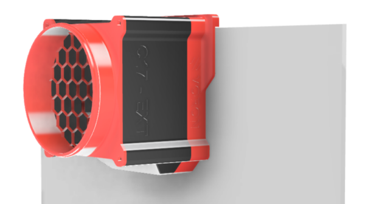
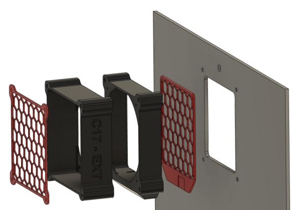
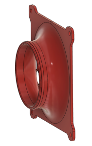

# C17 -EXT, External HEPA Carbon filter

The C17-EXT filter replaces the standard filter of the Voron 2.4 and to add one on the Switchwire . It has a 120mm fan and can use the C17-EXT-Cartridge filter (HEPA 13 and Carbon) or commercial HEPA Carbon filters.

This is a first publication, although all parts has been tested, there may be errors do not hesitate to contact me.

## 2 configurations

With adapter for standard back panel Voron

With specific back panel

For the Switchwire model only configuration 2 is possible.

## 2 options to replace the grid

 

## Assembly Manual

# BOMs

The list of parts is described in the manual according to the chosen configuration.

## Fan

For the 120mm fan, follow the recommendations in the documentation. 3 models:
* Efficient but noisy, the best choice (4000 rpm) : Aquatuning Alphacool 24810 ES (tested)
* Less powerful but quieter (3000 rpm) : Noctua NF-F12 iPPC 3000 PWM (tested, acceptable for commercial cartridges)
* Less powerful but quieter (3000 rpm) : Sunon MEC0251V1-000U-A99 (Not tested)

If you find other models at 4000 rpm, please send me the references.

## Filter cartridge

Two possibilities :
* Using the [C17-EXT-CARTRIDGE](../C17-EXT-CARTRIDGE)
* Use a commercial cartridge : [Alveo3D](https://www.alveo3d.com/en/product/hepa-h13-filter-p3d/)

# Credits

The C17-EXT Activated Carbon Filter was modelled in [Fusion 360](http://autodesk.com).

## Contributing

A complaint is a gift. Please, help me to improve the C17-EXT filter !

## License

Distributed under GNU General Public License version 3.0 (GPLv3)

## Contact

Discord: OboMaker3D#0669 - (<https://discord.com/user/OboMaker3D#0669>)

## Acknowledgements

[The Voron Dev Team](https://vorondesign.com/)
