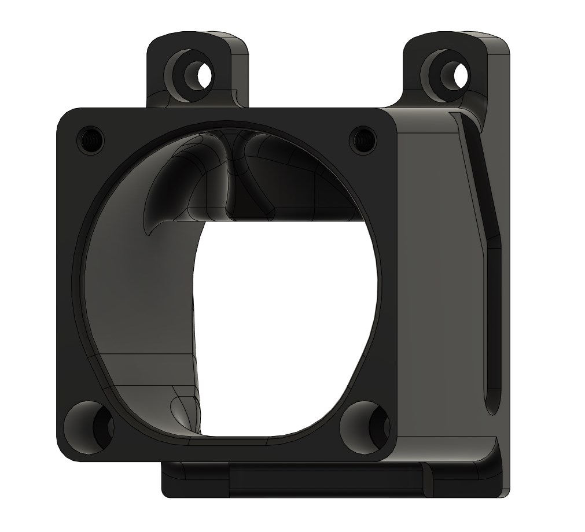
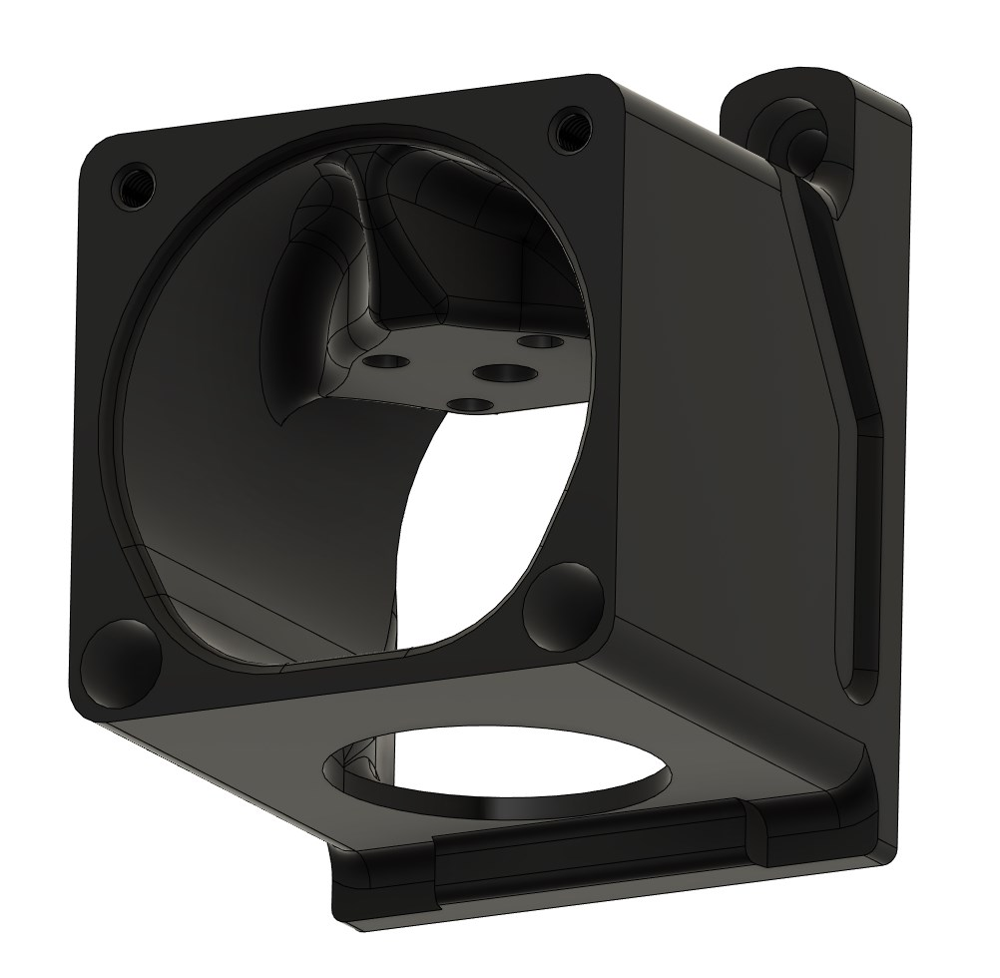
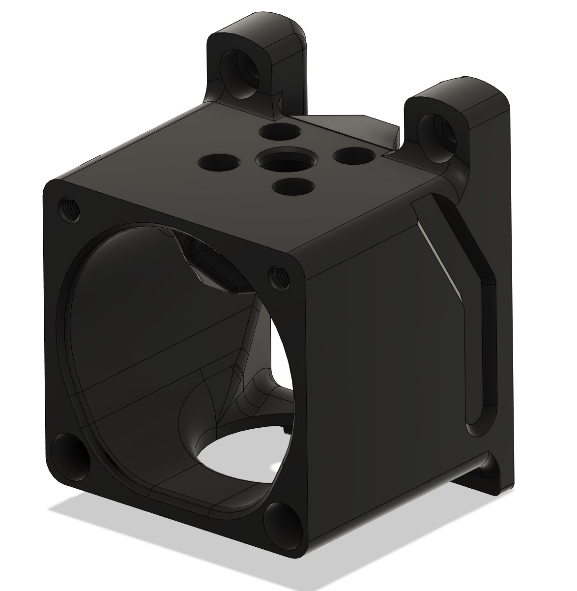
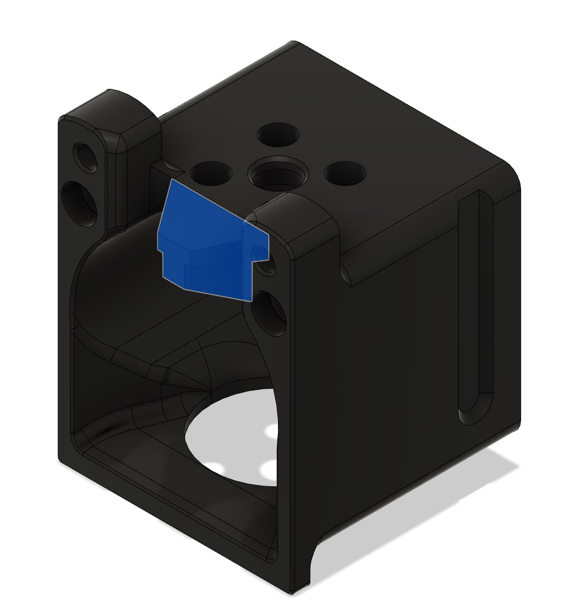

# Triangle Lab Dragon Hotend Toolhead

This toolhead mount design is based of Voron 2.2 Toolhead files.

It is one piece print, designed to work with everything you have included in you Dragon Hotend delivery package (screws and bowden collete) - no additional extra parts required.

No Support required, designed with break-away support block. Print as any other Voron part.

