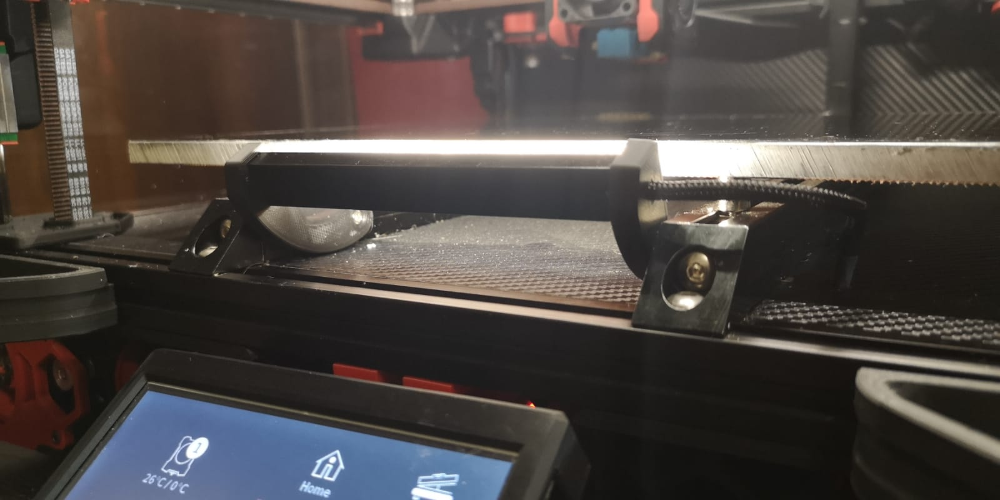
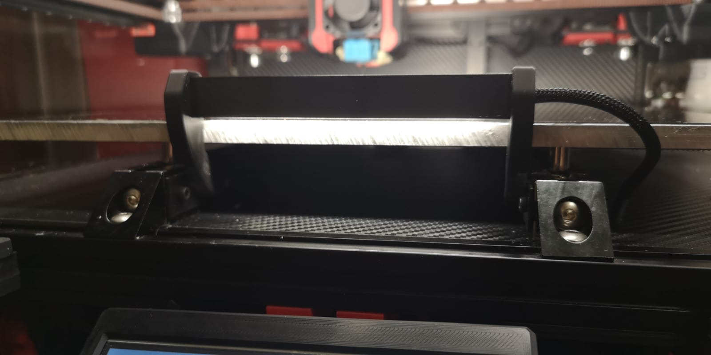
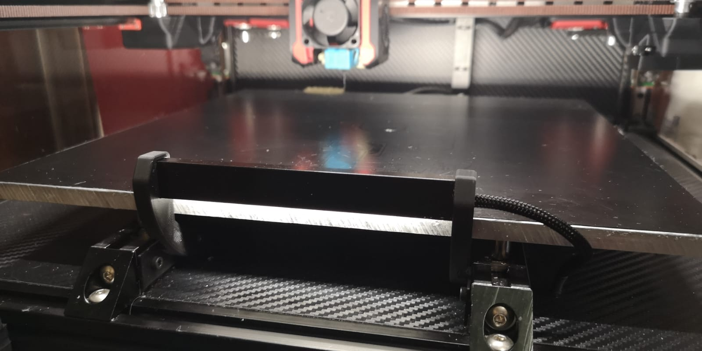
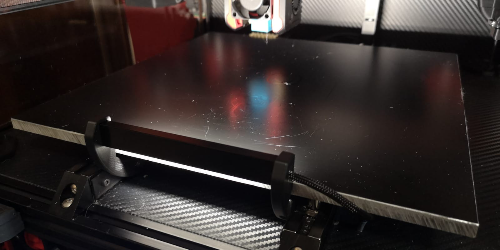

# Voron Swivle Front LED Bar

Title says it all actually.

But... :)

I was not happy with top mounted LEDs where toolhead puts shadow, especially relevant if you only print small object.

Everyone knows there is not enough space in front of the bed to put anything in there, hence I've designed this swivle bar. Bar provides a lot of light exactly where you need it. 
Most of the time it's in upward position, it's required to lay it low only if you print right in front of your bed.

While in upward position this LED bar does not colide with Toolhead during QGL or with front panel once in lower position!

No supports required during print.

You will need:
2x M3x6
2x M3x8
4x M3 nuts for extrusion slot mounting.

