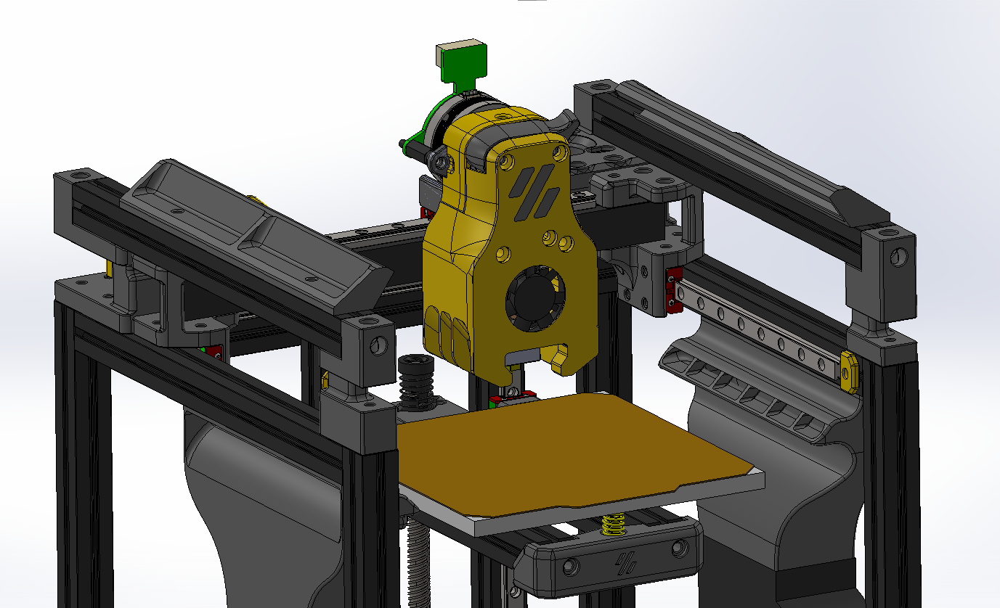
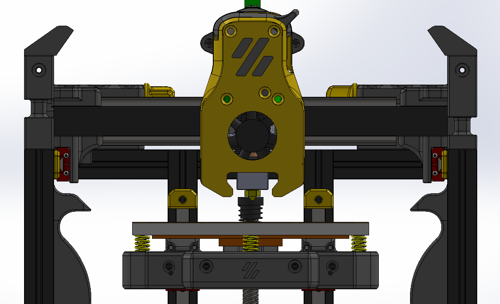
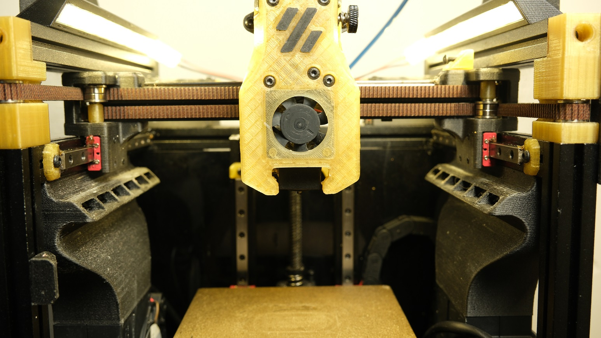
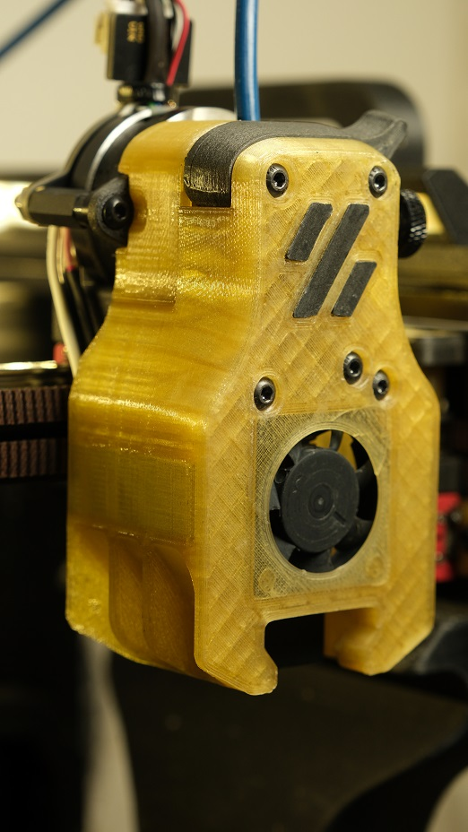
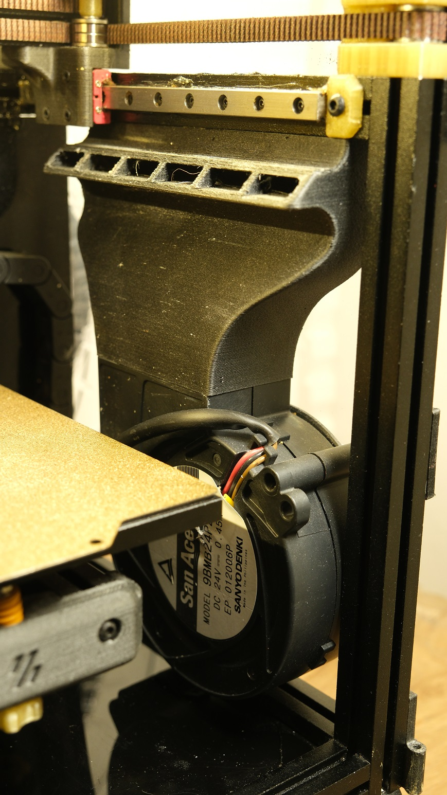
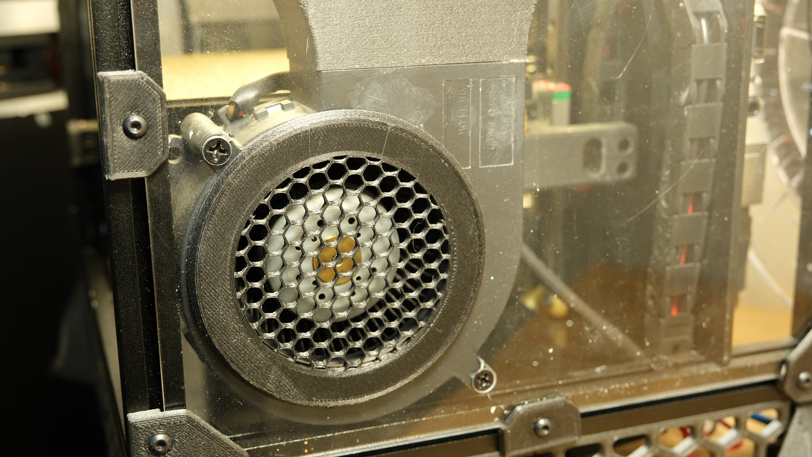

# Voron V0.1 High Flow Cooling

This mod is design to increase the cooling capability of a Voron V0.1 by using 2 [high flow blowers (San Ace B97)](https://products.sanyodenki.com/en/sanace/dc/blower/9BMB12P2K01/) and a massive fan duct.
Also the head is modify to help redirect the airflow from the nozzle.It's probably not necessary but I think the head look cool.

The fan duct is not symetrical, simply because like that the fan suck air from the outside of the printer.

The fan duct is screw on to the frame, and I also drill the plexiglass sheet to be able to screw the fan to it. 

This is not my original idea, this come from [247printing](https://247printing.gumroad.com/l/247zeroBeta1?layout=profile).

**FR**:

Cette modification est conçue pour augmenter la capacité de refroidissement de la Voron V0.1 en utilisant 2 [ventilateurs (San Ace B97)](https://products.sanyodenki.com/en/sanace/dc/blower/9BMB12P2K01/) et une grande conduite de ventilation.

Aussi la coque de la tête est modifiée pour aider à rediriger le flux d'air de la buse. Cela n'est probablement pas nécessaire mais je la trouve jolie.

La conduite de ventilateur n'est pas symétrique, simplement car avec cette disposition les ventilateurs aspirent l'air de l'extérieur de l'imprimante.

La conduite de ventilateur est visée sur la structure et j'ai aussi percé la vitre en plexiglass pour pouvoir visser la conduite à celle-ci.

Cette modification n'est pas mon idée, je me suis inspiré de [247printing](https://247printing.gumroad.com/l/247zeroBeta1?layout=profile).

